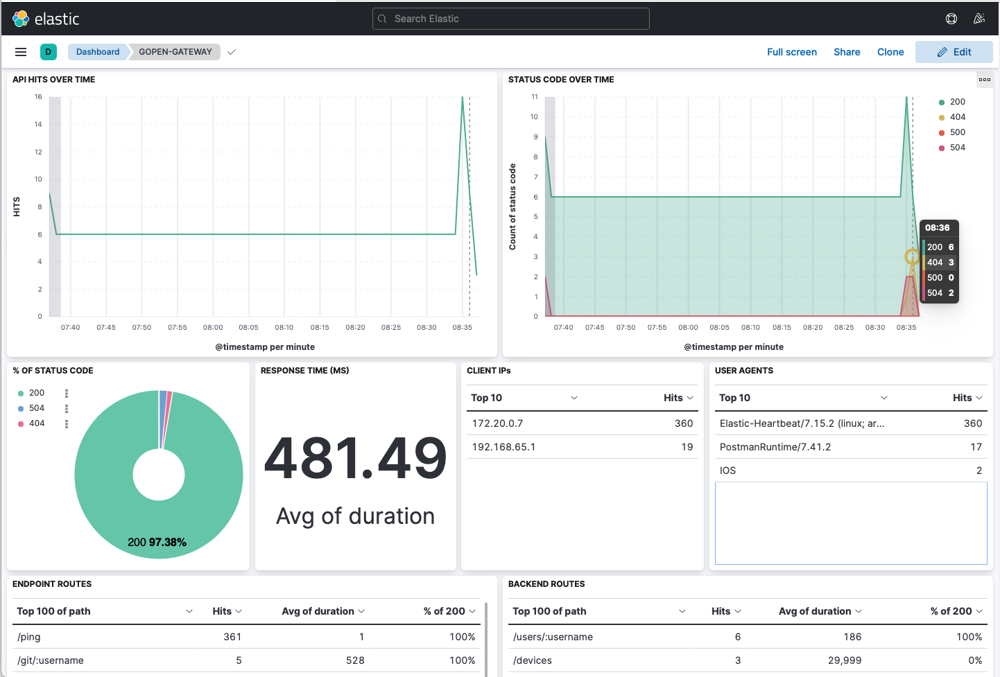
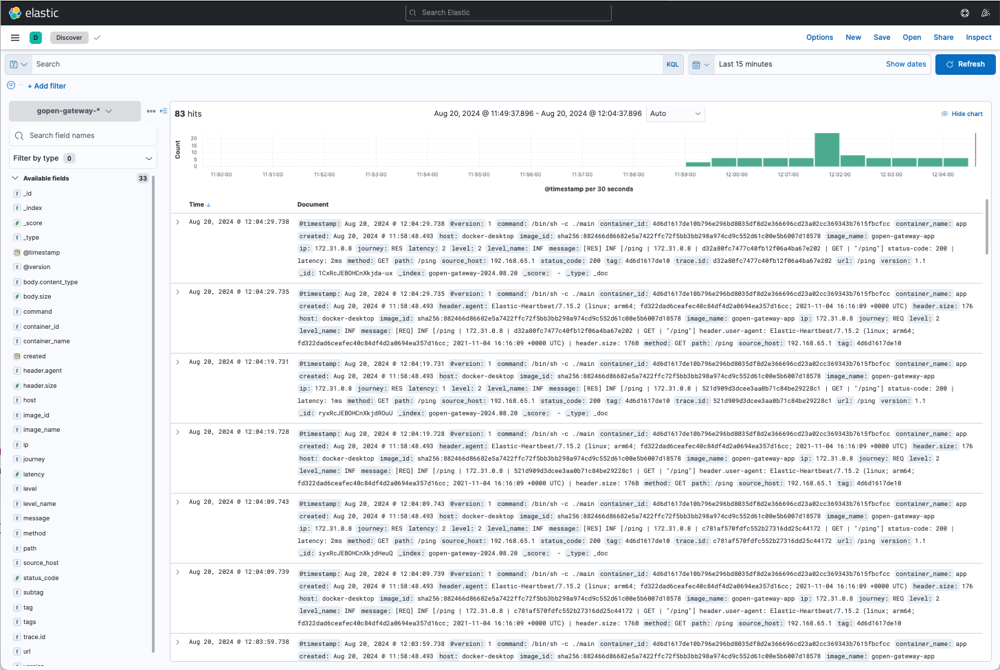
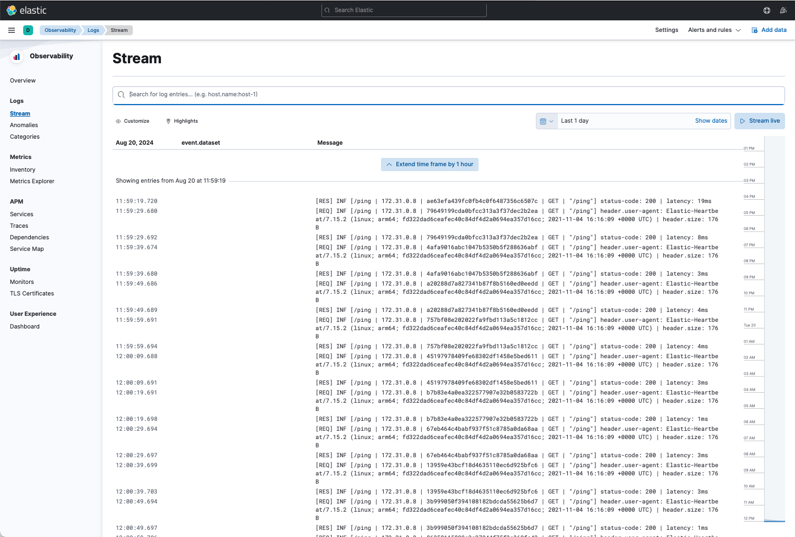

[](https://github.com/tech4works/gopen-gateway/releases/tag/v1.0.2)
[](https://github.com/tech4works/gopen-gateway-base)
[](https://github.com/tech4works/gopen-gateway-playground)
[](https://hub.docker.com/r/tech4works/gopen-gateway)
[](https://github.com/tech4works/gopen-gateway)
[](https://goreportcard.com/report/github.com/tech4works/gopen-gateway)
[](https://pkg.go.dev/github.com/tech4works/gopen-gateway/helper)
[](https://github.com/tech4works/gopen-gateway/blob/main/go.mod)
[](https://app.fossa.com/projects/git%2Bgithub.com%2Ftech4works%2Fgopen-gateway?ref=badge_small)

[//]: # (![United States]&#40;https://raw.githubusercontent.com/stevenrskelton/flag-icon/master/png/16/country-4x3/us.png&#41;)

[//]: # ([Inglês]&#40;https://github.com/tech4works/gopen-gateway/blob/main/README.en.md&#41; |)

[//]: # (![Spain]&#40;https://raw.githubusercontent.com/stevenrskelton/flag-icon/master/png/16/country-4x3/es.png&#41;)

[//]: # ([Espanhol]&#40;https://github.com/tech4works/gopen-gateway/blob/main/README.es.md&#41;)

O projeto GOPEN foi criado no intuito de ajudar os desenvolvedores a terem uma API Gateway robusta e de fácil manuseio,
com a oportunidade de atuar em melhorias agregando a comunidade, e o mais importante, sem gastar nada.
Foi desenvolvida, pois muitas APIs Gateway do mercado de forma gratuita, não atendem muitas necessidades mínimas
para uma aplicação, induzindo-o a fazer o upgrade.

Com essa nova API Gateway você não precisará equilibrar pratos para economizar na sua infraestrutura e arquitetura,
e ainda otimizará o seu desenvolvimento, veja abaixo todos os recursos disponíveis:

- Json de configuração simplificado para múltiplos ambientes.


- Configuração rápida de variáveis de ambiente.


- Execução via docker com hot reload de configuração opcional.


- Timeout granular, com uma configuração padrão para todos os endpoints, mas podendo especificar para cada endpoint.


- Cache granular, com estratégia e condição para o armazenamento customizável.


- Armazenamento de cache local ou global utilizando Redis.


- Limitador de uso e de carga granular, com uma configuração padrão para todos os endpoints, mas podendo especificar
  para cada endpoint.


- Segurança de CORS com validações de origens, método HTTP e headers.


- Timeout linear, enviando o tempo restante para processamento num cabeçalho de requisição.


- Múltiplos middlewares, para serem usados posteriormente no endpoint caso necessário.


- Filtragem personalizada de envio de Headers, Query e Body para os backends do endpoint.


- Processamento de múltiplos backends por endpoint.


- Aborte o processo de execução dos backends pelo código de status de forma personalizada.


- Chamadas concorrentes ao backend caso configurado.


- Customize sua requisição e resposta do backend utilizando nossos recursos:
    - Omita informações.
    - Mapeamento. (Header, Query e Body)
    - Projeção. (Header, Query e Body)
    - Personalização da nomenclatura do body.
    - Personalização do tipo do conteúdo do body.
    - Comprima o body de requisição usando GZIP ou DEFLATE.
    - Modificadores, são pontos e ações especificas para modificar algum conteúdo de requisição ou resposta.
    - Agrupe o body de resposta em um campo específico informado.


- Customize sua resposta de endpoint utilizando nossos recursos:
    - Omita informações vazias do body.
    - Agregue múltiplas respostas dos backends.
    - Personalização do tipo do body.
    - Personalização da nomenclatura do body.
    - Comprima o body de requisição usando GZIP ou DEFLATE.


- Rastreamento distribuído utilizando Elastic APM, Dashboard personalizado no Kibana, e logs bem estruturados com
  informações relevantes de configuração e acessos à API.

# Documentação

Para entender como funciona, precisamos explicar primeiro a estrutura dos ambientes dinâmicos que GOPEN aceita para sua
configuração e variáveis de ambiente, então vamos lá!

## Variáveis de ambiente

Independente de como irá utilizar a API Gateway, ela exige duas variáveis de ambiente que são:

### GOPEN_PORT

Porta aonde sua API Gateway irá ouvir e servir.

Exemplo: **8080**

### GOPEN_ENV

Qual ambiente sua API Gateway irá atuar.

Exemplo: **dev**

## Estrutura de pastas

Na estrutura do projeto, em sua raiz precisará ter uma pasta chamada "gopen" e dentro dela precisa ter as pastas
contendo os nomes dos seus ambientes, você pode dar o nome que quiser, essa pasta precisará ter pelo menos o arquivo
".json" de configuração da API Gateway, ficará mais o menos assim, por exemplo:

### Projeto GO

    gopen-gateway
    | - cmd
    | - internal
    | - gopen
      | - dev
      |   - .json
      |   - .env
      | - prd
      |   - .json
      |   - .env

### Projeto usando imagem docker

    nome-do-seu-projeto
    | - docker-compose.yml
    | - gopen
      | - dev
      |   - .json
      |   - .env
      | - prd
      |   - .json
      |   - .env

## JSON de configuração

Com base nesse arquivo JSON de configuração obtido através da variável de ambiente [GOPEN_ENV](#gopen_env) informada,
a aplicação terá seus endpoints e suas regras definidas, veja abaixo todos os campos possíveis e seus conceitos e
regras:

### Sumário

- [$schema](#schema)
- [@comment](#comment)
- [version](#version)
- [hot-reload](#hot-reload)
- [store](#store)
- [timeout](#timeout)
- [cache](#cache)
    - [duration](#cacheduration)
    - [strategy-headers](#cachestrategy-headers)
    - [only-if-methods](#cacheonly-if-methods)
    - [only-if-status-codes](#cacheonly-if-status-codes)
    - [allow-cache-control](#cacheallow-cache-control)
- [limiter](#limiter)
    - [max-header-size](#limitermax-header-size)
    - [max-body-size](#limitermax-body-size)
    - [max-multipart-memory-size](#limitermax-multipart-memory-size)
    - [rate](#limiterrate)
        - [capacity](#limiterratecapacity)
        - [every](#limiterrateevery)
- [security-cors](#security-cors)
    - [allow-origins](#security-corsallow-origins)
    - [allow-methods](#security-corsallow-methods)
    - [allow-headers](#security-corsallow-headers)
- [middlewares](#middlewares)
- [endpoints](#endpoints)
    - [@comment](#endpointcomment)
    - [path](#endpointpath)
    - [method](#endpointmethod)
    - [timeout](#endpointtimeout)
    - [cache](#endpointcache)
        - [enabled](#endpointcacheenabled)
        - [ignore-query](#endpointcacheignore-query)
        - [duration](#endpointcacheduration)
        - [strategy-headers](#endpointcachestrategy-headers)
        - [only-if-status-codes](#endpointcacheonly-if-status-codes)
        - [allow-cache-control](#endpointcacheallow-cache-control)
    - [limiter](#endpointlimiter)
    - [abort-if-status-codes](#endpointabort-if-status-codes)
    - [response](#endpointresponse)
        - [@comment](#endpointresponsecomment)
        - [aggregate](#endpointresponseaggregate)
        - [content-type](#endpointresponsecontent-type)
        - [content-encoding](#endpointresponsecontent-encoding)
        - [nomenclature](#endpointresponsenomenclature)
        - [omit-empty](#endpointresponseomit-empty)
    - [beforewares](#endpointbeforewares)
    - [afterwares](#endpointafterwares)
    - [backends](#endpointbackends)
        - [@comment](#endpointbackendcomment)
        - [hosts](#endpointbackendhosts)
        - [path](#endpointbackendpath)
        - [method](#endpointbackendmethod)
        - [request](#endpointbackendrequest)
            - [@comment](#endpointbackendrequestcomment)
            - [concurrent](#endpointbackendrequestconcurrent)
            - [omit-header](#endpointbackendrequestomit-header)
            - [omit-query](#endpointbackendrequestomit-query)
            - [omit-body](#endpointbackendrequestomit-body)
            - [content-type](#endpointbackendrequestcontent-type)
            - [content-encoding](#endpointbackendrequestcontent-encoding)
            - [nomenclature](#endpointbackendrequestnomenclature)
            - [omit-empty](#endpointbackendrequestomit-empty)
            - [header-mapper](#endpointbackendrequestheader-mapper)
            - [query-mapper](#endpointbackendrequestquery-mapper)
            - [body-mapper](#endpointbackendrequestbody-mapper)
            - [header-projection](#endpointbackendrequestheader-projection)
            - [query-projection](#endpointbackendrequestquery-projection)
            - [body-projection](#endpointbackendrequestbody-projection)
            - [header-modifiers](#endpointbackendrequestheader-modifiers)
                - [@comment](#endpointbackendrequestheader-modifiercomment)
                - [action](#endpointbackendrequestheader-modifieraction)
                - [key](#endpointbackendrequestheader-modifierkey)
                - [value](#endpointbackendrequestheader-modifiervalue)
                - [propagate](#endpointbackendrequestheader-modifierpropagate)
            - [param-modifiers](#endpointbackendrequestparam-modifiers)
                - [@comment](#endpointbackendrequestparam-modifiercomment)
                - [action](#endpointbackendrequestparam-modifieraction)
                - [key](#endpointbackendrequestparam-modifierkey)
                - [value](#endpointbackendrequestparam-modifiervalue)
                - [propagate](#endpointbackendrequestparam-modifierpropagate)
            - [query-modifiers](#endpointbackendrequestquery-modifiers)
                - [@comment](#endpointbackendrequestquery-modifiercomment)
                - [action](#endpointbackendrequestquery-modifieraction)
                - [key](#endpointbackendrequestquery-modifierkey)
                - [value](#endpointbackendrequestquery-modifiervalue)
                - [propagate](#endpointbackendrequestquery-modifierpropagate)
            - [body-modifiers](#endpointbackendrequestbody-modifiers)
                - [@comment](#endpointbackendrequestbody-modifiercomment)
                - [action](#endpointbackendrequestbody-modifieraction)
                - [key](#endpointbackendrequestbody-modifierkey)
                - [value](#endpointbackendrequestbody-modifiervalue)
                - [propagate](#endpointbackendrequestbody-modifierpropagate)
        - [response](#endpointbackendresponse)
            - [@comment](#endpointbackendresponsecomment)
            - [omit](#endpointbackendresponseomit)
            - [omit-header](#endpointbackendresponseomit-header)
            - [omit-body](#endpointbackendresponseomit-body)
            - [header-mapper](#endpointbackendresponseheader-mapper)
            - [body-mapper](#endpointbackendresponsebody-mapper)
            - [header-projection](#endpointbackendresponseheader-projection)
            - [body-projection](#endpointbackendresponsebody-projection)
            - [header-modifiers](#endpointbackendresponseheader-modifiers)
                - [@comment](#endpointbackendresponseheader-modifiercomment)
                - [action](#endpointbackendresponseheader-modifieraction)
                - [key](#endpointbackendresponseheader-modifierkey)
                - [value](#endpointbackendresponseheader-modifiervalue)
            - [body-modifiers](#endpointbackendresponsebody-modifiers)
                - [@comment](#endpointbackendresponsebody-modifiercomment)
                - [action](#endpointbackendresponsebody-modifieraction)
                - [key](#endpointbackendresponsebody-modifierkey)
                - [value](#endpointbackendresponsebody-modifiervalue)

### $schema

Campo opcional, para o auxílio na escrita e regras do próprio JSON de configuração, podendo ser ultima versão:

      https://raw.githubusercontent.com/tech4works/gopen-gateway/main/json-schema.json

Ou uma versão específica:

      https://raw.githubusercontent.com/tech4works/gopen-gateway/v1.0.0/json-schema.json

### @comment

Campo opcional, do tipo string, livre para anotações.

### version

Campo opcional, do tipo string, usado para controle de versão e também usado no retorno do endpoint
estático [/version](#version-1).

### hot-reload

Campo opcional, do tipo booleano, o valor padrão é `false`, é utilizado para o carregamento automático quando
houver alguma alteração no arquivo .json e .env na pasta do ambiente selecionado.

### store

Campo opcional, do tipo objeto, o valor padrão é o armazenamento local em cache, caso seja informado, o campo `redis`
passa a ser obrigatório e o campo `address` também.

> ⚠️ **IMPORTANTE**
>
> Caso utilize o armazenamento global de cache, o Redis, é indicado que os valores de endereço e senha sejam preenchidos
> utilizando variável de ambiente, como no exemplo acima.

### timeout

Campo opcional, do tipo string, o valor padrão é `30s`, esse campo é responsável pelo tempo máximo de duração do
processamento de cada requisição.

Caso a requisição ultrapasse esse tempo informado, á API Gateway irá abortar todas as transações em andamento e
retornará o código de status `504 (Gateway Timeout)`.
Veja mais sobre esse retorno [clicando aqui](#504-gateway-timeout).

**Valores aceitos**

- s para segundos
- m para minutos
- h para horas
- ms para milissegundos
- us (ou µs) para microssegundos
- ns para nanossegundos

**Exemplos**

- 10s
- 5ms
- 1h30m
- 1.5h

> ⚠️ **IMPORTANTE**
>
> Caso seja informado no [endpoint.timeout](#endpointtimeout), damos prioridade ao valor informado do endpoint,
> caso contrário, seguiremos com o valor informado ou padrão desse campo, na raiz do JSON de configuração.

### cache

Campo opcional, é responsável pela configuração global de cache, caso o endpoint em específico informe o campo
[endpoint.cache.enabled](#endpointcacheenabled) com o valor `true` apenas, ele irá herdar os outros valores do mesmo
para sí.

O valor do cache é apenas gravado 1 vez a cada X duração informada no campo `duration`.

Os campos [only-if-status-codes](#cacheonly-if-status-codes) e [only-if-methods](#cacheonly-if-methods) são utilizados
para verificar se naquele endpoint habilitado a ter cache, pode ser lido e escrito o cache com base no método HTTP e
código de status de resposta, veja mais sobre eles abaixo.

Caso a resposta não seja "fresca", ou seja, foi respondida pelo cache, o header `X-Gopen-Cache` terá o valor `true`
caso contrário, o valor será `false`.

> ⚠️ **IMPORTANTE**
>
> Caso o objeto seja informado na estrutura do [endpoint.cache](#endpointcache), damos prioridade aos valores informados
> lá, caso contrário, seguiremos com os valores informados nesse campo.

### cache.duration

Campo obrigatório, do tipo string, indica o tempo que o cache irá durar.

**Valores aceitos**:

- s para segundos
- m para minutos
- h para horas
- ms para milissegundos
- us (ou µs) para microssegundos
- ns para nanossegundos

**Exemplos**

- 1h
- 15.5ms
- 1h30m
- 1.5m

### cache.strategy-headers

Campo opcional, do tipo lista de string, é utilizado para definir a estratégia da chave do cache a partir dos headers
informados.

O valor padrão de chave de cache é pela url e método HTTP da requisição tornando-o um cache global
por endpoint, caso informado os cabeçalhos a serem usados na estrátegia eles são agregados nos valores padrões de
chave, por exemplo, vamos utilizar o campo `X-Forwarded-For` e o `Device` do cabeçalho, o valor final da chave
ficaria:

     GET:/users/find/479976139:177.130.228.66:95D4AF55-733D-46D7-86B9-7EF7D6634EBC

A descrição da lógica por trás dessa chave é:

     método:url:X-Forwarded-For:Device

Sem a estrátegia preenchida, a lógica padrão fica assim:

     método:url

Então o valor padrão para esse endpoint fica assim sem a estrátegia preenchida:

     GET:/users/find/479976139

Nesse exemplo tornamos o cache antes global para o endpoint em espécifico, passa a ser por cliente!
Lembrando que isso é um exemplo simples, você pode ter a estrátegia que quiser com base no header de sua aplicação.

### cache.only-if-methods

Campo opcional, do tipo lista de string, é responsável por decidir se irá ler e gravar o cache do endpoint
(que está habilitado a ter cache) pelo método HTTP informado.

O valor padrão é apenas o método HTTP `GET`, caso informada vazia, qualquer método HTTP será aceito.

### cache.only-if-status-codes

Campo opcional, do tipo lista de inteiro, é responsável por decidir se irá gravar o cache do endpoint
(que está habilitado a ter cache) pelo código de status HTTP de resposta do mesmo.

O valor padrão é uma lista de códigos de status HTTP de sucessos reconhecidos, caso informada vazia,
qualquer código de status HTTP de resposta será aceito.

### cache.allow-cache-control

Campo opcional, do tipo booleano, é responsável por considerar ou não o header de requisição `Cache-Control` para tomada
de decisão se irá gravar ou ler o cache.

O valor padrão é `false`, caso seja informado como `true` a API Gateway irá considerar o header `Cache-Control` seguindo
as regras a seguir a partir do valor informado na requisição ou na resposta dos backends:

**no-cache**

Esse valor é apenas considerado no header da requisição, caso informado desconsideramos a leitura do cache
e seguimos com o processo normal para obter a resposta "fresca".

**no-store**

Esse valor é considerado apenas na resposta escrita por seus backends, caso informado não gravamos o
cache.

### limiter

Campo opcional, do tipo objeto, é responsável pelas regras de limitação da API Gateway, seja de tamanho ou taxa,
os valores padrões variam de campo a campo, veja:

### limiter.max-header-size

Campo opcional, do tipo string, o valor padrão é `1MB`, é responsável por limitar o tamanho do cabeçalho de requisição.

Caso o tamanho do cabeçalho ultrapasse o valor informado, a API Gateway irá abortar a requisição com o código de
status `431 (Request header fields too large)`.
Veja mais sobre esse retorno [clicando aqui](#431-request-header-fields-too-large).

**Valores aceitos**

- B para Byte
- KB para KiloByte
- MB para Megabyte
- GB para Gigabyte
- TB para Terabyte
- PB para Petabyte
- EB para Exabyte
- ZB para Zettabyte
- YB para Yottabyte

**Exemplos**

- 1B
- 50KB
- 5MB
- 1.5GB

### limiter.max-body-size

Campo opcional, do tipo string, o valor padrão é `3MB`, é responsável por limitar o tamanho do corpo da requisição.

Caso o tamanho do corpo ultrapasse o valor informado, a API Gateway irá abortar a requisição com o código de status
`413 (Request entity too large)`.

**Valores aceitos**

- B para Byte
- KB para KiloByte
- MB para Megabyte
- GB para Gigabyte
- TB para Terabyte
- PB para Petabyte
- EB para Exabyte
- ZB para Zettabyte
- YB para Yottabyte

**Exemplos**

- 1B
- 50KB
- 5MB
- 1.5GB

### limiter.max-multipart-memory-size

Campo opcional, do tipo string, o valor padrão é `5MB`, é responsável por limitar o tamanho do corpo multipart/form da
requisição, geralmente utilizado para envio de arquivos, imagens, etc.

Caso o tamanho do corpo ultrapasse o valor informado, a API Gateway irá abortar a requisição com o código de status
`413 (Request entity too large)`.
Veja mais sobre esse retorno [clicando aqui](#413-request-entity-too-large).

**Valores aceitos**

- B para Byte
- KB para KiloByte
- MB para Megabyte
- GB para Gigabyte
- TB para Terabyte
- PB para Petabyte
- EB para Exabyte
- ZB para Zettabyte
- YB para Yottabyte

**Exemplos**

- 1B
- 50KB
- 5MB
- 1.5GB

### limiter.rate

Campo opcional, do tipo objeto, caso seja informado, o campo [capacity](#limiterratecapacity) torna-se obrigatório,
esse objeto é responsável por limitar a taxa de requisição pelo IP.

O limite é imposto obtendo a capacidade máxima pelo campo [capacity](#limiterratecapacity) por X duração, informado
no campo [every](#limiterrateevery).

Caso essa capacidade seja ultrapassada, a API Gateway por segurança abortará a requisição, retornando
`429 (Too many requests)`.
Veja mais sobre esse retorno [clicando aqui](#429-too-many-requests).

### limiter.rate.capacity

Campo obrigatório, do tipo inteiro, indica a capacidade máxima de requisições.

O valor padrão é `5`, e o mínimo que poderá ser informado é `1`.

### limiter.rate.every

Campo opcional, do tipo string, o valor padrão é `1s`, indica o valor da duração da verificação da capacidade máxima de
requisições.

**Valores aceitos**:

- s para segundos
- m para minutos
- h para horas
- ms para milissegundos
- us (ou µs) para microssegundos
- ns para nanossegundos

**Exemplos**

- 1h
- 15.5ms
- 1h30m
- 1.5m

### security-cors

Campo opcional, do tipo objeto, usado para segurança do CORS da API Gateway, todos os campos por padrão são vazios,
não restringindo os valores de origem, métodos e cabeçalhos.

Caso queira restringir, e a requisição não corresponda com as configurações impostas, a API Gateway por segurança
irá abortar a requisição retornando `403 (Forbidden)`.

### security-cors.allow-origins

Campo opcional, do tipo lista de string, os itens da lista precisam indicar quais IPs de origem a API Gateway
permite receber nas requisições.

### security-cors.allow-methods

Campo opcional, do tipo lista de string, os itens da lista precisam indicar quais métodos HTTP a API Gateway
permite receber nas requisições.

### security-cors.allow-headers

Campo opcional, do tipo lista de string, os itens da lista precisam indicar quais campos de cabeçalho HTTP a API Gateway
permite receber nas requisições.

### middlewares

Campo opcional, é responsável pela configuração de seus middlewares de aplicação, é um mapa com chaves
em string mencionando o nome do seu middleware, esse nome poderá ser utilizado em seus [endpoints](#endpoints)
como [endpoint.beforewares](#endpointbeforewares) e [endpoint.afterwares](#endpointafterwares).

O valor da chave é um objeto de [backend](#endpointbackendcomment), porém, com uma observação, esse objeto terá sua
resposta caso não [abortada](#resposta-abortada), omitida automáticamente pelo endpoint, já que respostas de middlewares
não são exibidas para o cliente final HTTP, porém, sua resposta será armazenada ao longo da requisição HTTP feita no
endpoint,
podendo ter seus valores de requisição e resposta obtidos e manipulados.

Para entender melhor essa ferramenta poderosa, na prática, veja os exemplos de middlewares usados como `beforewares`
e `afterwares` feitos no projeto de [playground](https://github.com/tech4works/gopen-gateway-playground).

### endpoints

Campo obrigatório, é uma lista de objeto, representa cada endpoint da API Gateway que será registrado para ouvir e
servir as requisições HTTP.

### endpoint.@comment

Campo opcional, do tipo string, campo livre para anotações.

### endpoint.path

Campo obrigatório, do tipo string, responsável pelo caminho URI do endpoint que irá ouvir e servir.

Caso queira ter parâmetros dinâmicos nesse endpoint, apenas use o padrão `":nome do parâmetro"` por exemplo
`"/users/:id/status/:status"`, a API Gateway irá entender que teremos 2 parâmetros dinâmicos desse endpoint,
esses valores podem ser repassados para os backends subjacentes, exemplo:

**Endpoint**

- path: `"/users/:id/status/:status"`
- resultado: `"/users/1/status/removed"`

**Backend 1**

- path: `"/users/:id"`
- resultado: `"/users/1"`

**Backend 2**

- path: `"/users/:id/status/:status"`
- resultado: `"/users/1/status/removed"`

No exemplo acima vemos que o parâmetro pode ser utilizado como quiser como path nas requisições de backend do endpoint
em questão.

### endpoint.method

Campo obrigatório, do tipo string, responsável por definir qual método HTTP o endpoint será registrado.

### endpoint.timeout

Campo opcional, do tipo string, é semelhante ao campo [timout](#timeout), porém, será aplicado apenas para o endpoint
em questão.

> ⚠️ **IMPORTANTE**
>
> Caso omitido, será herdado o valor do campo [timeout](#timeout).

### endpoint.cache

Campo opcional, do tipo objeto, é responsável pela configuração de cache para o endpoint em questão.

> ⚠️ **IMPORTANTE**
>
> Caso informado, o campo [enabled](#endpointcacheenabled) se torna obrigatório, os outros campos, caso omitidos,
> irá herdar da configuração [cache](#cache) na raiz caso exista e se preenchida.
>
> Se por acaso, tenha omitido o campo `duration` tanto na atual configuração como na configuração [cache](#cache) na
> raiz, o campo [enabled](#endpointcacheenabled) é ignorado considerando-o sempre como `false` pois não foi informado a
> duração do cache em ambas configurações.

### endpoint.cache.enabled

Campo obrigatório, do tipo booleano, o valor padrão é `false`, indica o desejo que tenha cache em seu endpoint ou não.

> ⚠️ **IMPORTANTE**
>
> Caso esteja `true` mas não informado o campo `duration` na configuração atual e nem na [raiz](#cache), esse campo
> será ignorado considerando-o sempre como `false`.

### endpoint.cache.ignore-query

Campo opcional, do tipo booleano, caso não informado o valor padrão é `false`.

Caso o valor seja `true` a API Gateway irá ignorar os parâmetros de busca da URL ao
criar a chave de armazenamento, caso contrário ela considerára os parâmetros de busca da URL
ordenando alfabéticamente as chaves e valores.

### endpoint.cache.duration

É semelhante ao campo [cache.duration](#cacheduration), porém, será aplicado apenas para o endpoint em questão.

> ⚠️ **IMPORTANTE**
>
> Caso omitido, será herdado o valor do campo [cache.duration](#cacheduration).
>
> Caso seja omitido nas duas configurações, o campo [enabled](#endpointcacheenabled) será ignorado considerando-o sempre
> como `false`.

### endpoint.cache.strategy-headers

Campo opcional, do tipo lista de string, é semelhante ao campo [cache.strategy-headers](#cachestrategy-headers), porém,
será aplicado
apenas para o endpoint em questão.

> ⚠️ **IMPORTANTE**
>
> Caso omitido, será herdado o valor do campo [cache.strategy-headers](#cachestrategy-headers).
>
> Caso seja informado vazio, o valor do não será herdado, porém, será aplicado o valor [padrão](#cachestrategy-headers)
> para o endpoint em questão.

### endpoint.cache.only-if-status-codes

Campo opcional, do tipo lista de inteiro, é semelhante ao
campo [cache.only-if-status-codes](#cacheonly-if-status-codes), porém, será aplicado
apenas para o endpoint em questão.

> ⚠️ **IMPORTANTE**
>
> Caso omitido, será herdado o valor do campo [cache.only-if-status-codes](#cacheonly-if-status-codes).
>
> Caso seja informado vazio, o valor do não será herdado, porém, será aplicado o
> valor [padrão](#cacheonly-if-status-codes) para o endpoint em questão.

### endpoint.cache.allow-cache-control

Campo opcional, do tipo booleano, é semelhante ao campo [cache.allow-cache-control](#cacheallow-cache-control), porém,
será aplicado apenas
para o endpoint em questão.

> ⚠️ **IMPORTANTE**
>
> Caso omitido, será herdado o valor do campo [cache.allow-cache-control](#cacheallow-cache-control).

### endpoint.limiter

Campo opcional, do tipo objeto, é semelhante ao campo [limiter](#limiter), porém, será aplicado apenas para o endpoint
em questão.

> ⚠️ **IMPORTANTE**
>
> Caso omitido, será herdado o valor do campo [limiter](#limiter).
>

### endpoint.abort-if-status-codes

Campo opcional, do tipo lista de inteiros, o valor padrão é nulo, indicando que qualquer backend executado no endpoint
que tenha respondido o código de status HTTP maior ou igual a `400 (Bad request)` será abortado.

Caso informado, e um backend retorna o código de status HTTP indicado na configuração, o endpoint será abortado, isso
significa que os outros backends configurados após o mesmo, não serão executados, e o endpoint irá retornar a resposta
do mesmo ao cliente final.

Caso queira que nenhum código de status HTTP seja abortado no endpoint, apenas informe o campo vazio.

Veja como o endpoint será respondido após um backend ser abortado [clicando aqui](#resposta-abortada).

### endpoint.response

Campo opcional, do tipo objeto, é responsável pela customização da resposta do endpoint.

Veja mais sobre as regras de resposta da API Gateway [clicando aqui](#lógica-de-resposta).

### endpoint.response.@comment

Campo opcional, do tipo string, livre para anotações.

### endpoint.response.aggregate

Campo opcional, do tipo booleano, o valor padrão é `false`, é responsável por agregar todos os corpos das respostas
recebidas pelos backends em apenas um corpo.

### endpoint.response.content-type

Campo opcional, do tipo string, é responsável por informar qual conteúdo deseja para o corpo de resposta do endpoint.

**Valores aceitos**

- JSON
- XML
- TEXT

### endpoint.response.content-encoding

Campo opcional, do tipo string, é responsável por informar qual codificação deseja para o corpo da resposta do endpoint.

**Valores aceitos**

- NONE (Remove a codificação caso tenha, e retorna sem nenhum tipo de codificação)
- GZIP
- DEFLATE

### endpoint.response.nomenclature

Campo opcional, do tipo string, é responsável por informar qual nomenclatura deseja para os campos do corpo JSON
da resposta do endpoint.

**Valores aceitos**

- LOWER_CAMEL
- CAMEL
- SNAKE
- SCREAMING_SNAKE
- KEBAB
- SCREAMING_KEBAB

### endpoint.response.omit-empty

Campo opcional, do tipo booleano, o valor padrão é `false`, indica o desejo de omitir os campos vazios do corpo JSON
da resposta do endpoint.

### endpoint.beforewares

Campo opcional, do tipo lista de string, o valor padrão é vazio, indicando que o endpoint não tem nenhum middleware
de pré-requisições.

Caso informado, o endpoint irá executar as requisições, posição por posição, começando no início da lista. Caso o valor
em string da posição a ser executada estiver configurada no campo [middlewares](#middlewares) corretamente, será
executado o backend configurado neste campo, caso contrário, irá ignorar a posição apenas imprimindo um log de atenção.

### endpoint.afterwares

Campo opcional, do tipo lista de string, o valor padrão é vazio, indicando que o endpoint não tem nenhum middleware
de pós-requisições.

Caso informado, o endpoint irá executar as requisições, posição por posição, começando no início da lista. Caso o valor
em string da posição a ser executada estiver configurada no campo [middlewares](#middlewares) corretamente, será
executado o
backend configurado no mesmo, caso contrário, irá ignorar a posição apenas imprimindo um log de atenção.

### endpoint.backends

Campo obrigatório, do tipo lista de objeto, responsável pela execução principal do endpoint é uma lista que indica todos
os serviços necessários para que o endpoint execute e retorne a resposta esperada.

### endpoint.backend.@comment

Campo opcional, do tipo string, campo livre para anotações.

### endpoint.backend.hosts

Campo obrigatório, do tipo lista de string, é responsável pelos hosts do seu serviço que a API Gateway irá chamar
juntamente com o campo [backend.path](#endpointbackendpath).

De certa forma podemos ter um load balancer "burro", pois o backend irá sortear nessa lista qual host irá ser chamado,
com isso podemos informar múltiplas vezes o mesmo host para balancear as chamadas, veja:

**50% para cada host**

````json
[
  "https://instance-01",
  "https://instance-02"
]
````

**75% no host "instance-01" e 15% no host "instance-02"**

````json
[
  "https://instance-01",
  "https://instance-02",
  "https://instance-02",
  "https://instance-02"
]
````

**33.3% no host "instance-01" e 66.7% no host "instance-02"**

````json
[
  "https://instance-01",
  "https://instance-02",
  "https://instance-02"
]
````

### endpoint.backend.path

Campo obrigatório, do tipo string, o valor indica a URL do caminho do serviço backend.

Utilizamos um dos [endpoint.backend.hosts](#endpointbackendhosts) informados e juntamos com o path fornecido,
por exemplo, no campo hosts temos o valor

```json
[
  "https://instance-01",
  "https://instance-02"
]
```

E nesse campo path temos o valor

```text
/users/status
```

O backend irá construir a seguinte URL de requisição depois do load balance

```text
https://instance-02/users/status
```

Veja como o host é balanceado [clicando aqui](#endpointbackendhosts).

### endpoint.backend.method

Campo obrigatório, do tipo string, o valor indica qual método HTTP o serviço backend espera.

### endpoint.backend.request

Campo opcional, do tipo objeto, é responsável pela customização da requisição que será feita ao backend.

### endpoint.backend.request.@comment

Campo opcional, do tipo string, campo livre para anotações.

### endpoint.backend.request.concurrent

Campo opcional, do tipo inteiro, é responsável pela quantidade de requisições concorrentes que deseja fazer ao
serviço backend.

O valor padrão é `0`, indicando que será executado apenas 1 requisição de forma síncrona, os valores aceitos são
de no mínimo `2` e no máximo `10`.

### endpoint.backend.request.omit-header

Campo opcional, do tipo booleano, o valor padrão é `false`, indica o desejo de omitir o cabeçalho da requisição.

### endpoint.backend.request.omit-query

Campo opcional, do tipo booleano, o valor padrão é `false`, indica o desejo de omitir todos os parâmetros de busca da
requisição.

### endpoint.backend.request.omit-body

Campo opcional, do tipo booleano, o valor padrão é `false`, indica o desejo de omitir o corpo da requisição.

### endpoint.backend.request.content-type

Campo opcional, do tipo string, é responsável por informar qual conteúdo deseja para o corpo da requisição.

**Valores aceitos**

- JSON
- XML
- TEXT

**Exemplo**

Corpo de requisição atual:

```json
{
  "id": "Summer",
  "name": "Veranito fresquito"
}
```

Configuramos o campo content-type para `XML` e o resultado foi:

```xml

<root>
    <id>Summer</id>
    <name>Veranito fresquito</name>
</root>
```

### endpoint.backend.request.content-encoding

Campo opcional, do tipo string, é responsável por informar qual codificação deseja para o corpo da requisição.

**Valores aceitos**

- NONE (Remove a codificação caso tenha, e retorna sem nenhum tipo de codificação)
- GZIP
- DEFLATE

### endpoint.backend.request.nomenclature

Campo opcional, do tipo string, é responsável por informar qual nomenclatura deseja para os campos do corpo JSON
da requisição.

**Valores aceitos**

- LOWER_CAMEL
- CAMEL
- SNAKE
- SCREAMING_SNAKE
- KEBAB
- SCREAMING_KEBAB

**Exemplo**

Corpo atual:

```json
{
  "id": "Summer",
  "name": "Veranito fresquito",
  "start_date": "2017/02/10",
  "end_date": "2017/02/15",
  "address": {
    "street_address": "21 2nd Street",
    "city": "New York",
    "state": "NY",
    "postal_code": "10021"
  }
}
```

Configuramos o campo nomenclature para `LOWER_CAMEL` e o resultado foi:

```json
{
  "id": "Summer",
  "name": "Veranito fresquito",
  "startDate": "2017/02/10",
  "endDate": "2017/02/15",
  "address": {
    "streetAddress": "21 2nd Street",
    "city": "New York",
    "state": "NY",
    "postalCode": "10021"
  }
}
```

### endpoint.backend.request.omit-empty

Campo opcional, do tipo booleano, o valor padrão é `false`, indica o desejo de omitir os campos vazios do corpo JSON
da requisição.

### endpoint.backend.request.header-mapper

Campo opcional, é responsável por mapear os campos do cabeçalho de requisição, fazendo um de/para do nome do campo atual
para o nome desejado, veja o exemplo:

Cabeçalho atual:

````text
Content-Type: application/json
X-Value-Id: 4ae6c92d16089e521626
X-Device-Id: asajlaks212
X-Test-Id: asdkmalsd123
Date: Tue, 23 Apr 2024 11:37:26 GMT
Content-Length: 620
````

Configuração do header-mapper:

````json
{
  "X-Value-Id": "X-New-Value-Id",
  "X-Device-Id": "X-New-Device-Id",
  "X-Test-Id": "X-New-Test-Id"
}
````

Resultado

````text
Content-Type: application/json
X-New-Value-Id: 4ae6c92d16089e521626
X-New-Device-Id: asajlaks212
X-New-Test-Id: asdkmalsd123
Date: Tue, 23 Apr 2024 11:37:26 GMT
Content-Length: 620
````

> ⚠️ **IMPORTANTE**
>
> Só é permitido a customização de chaves não obrigatórias que não sejam:
>
> - Content-Type
> - Content-Encoding
> - Content-Length
> - X-Forwarded-For

### endpoint.backend.request.query-mapper

Campo opcional, do mapa chave-valor string, é responsável por mapear os campos dos parâmetros de busca
da requisição, fazendo um de/para do nome do campo atual para o nome desejado, veja o exemplo:

URL com os parâmetros de busca:

````
/users?id=23&email=gabrielcataldo@gmail.com&phone=47991271234
````

Configuração query-mapper:

```json
{
  "id": "user_id",
  "email": "mail",
  "phone": "phone_number"
}
```

Resultado:

````
/users?user_id=23&mail=gabrielcataldo@gmail.com&phone_number=47991271234
````

### endpoint.backend.request.body-mapper

Campo opcional, do tipo mapa chave-valor string, é responsável por mapear os campos do corpo JSON da requisição,
fazendo um de/para do nome do campo atual para o nome desejado, veja o exemplo:

Corpo atual da requisição:

````json
{
  "id": 1,
  "firstName": "John",
  "lastName": "Smith",
  "age": 25,
  "address": {
    "streetAddress": "21 2nd Street",
    "city": "New York",
    "state": "NY",
    "postalCode": "10021"
  }
}
````

Configuração do body-mapper:

```json
{
  "firstName": "personalData.firstName",
  "lastName": "personalData.lastName",
  "age": "personalData.age"
}
```

Resultado:

```json
{
  "id": 1,
  "personalData": {
    "firstName": "John",
    "lastName": "Smith",
    "age": 25
  },
  "address": {
    "streetAddress": "21 2nd Street",
    "city": "New York",
    "state": "NY",
    "postalCode": "10021"
  }
}
```

### endpoint.backend.request.header-projection

Campo opcional, do tipo objeto, é responsável por customizar o envio de campos do cabeçalho de requisição ao serviço
backend.

**Valores aceitos para os campos**

- `-1`: Significa que você deseja remover o campo indicado.
- `1`: Significa que você deseja manter o campo indicado.

**Exemplo**

Cabeçalho atual:

````text
Content-Type: application/json
X-Value-Id: 4ae6c92d16089e521626
X-Device-Id: asajlaks212
X-Test-Id: asdkmalsd
X-User-Id: 123
Date: Tue, 23 Apr 2024 11:37:26 GMT
Content-Length: 620
````

Configuração do header-projection:

````json
{
  "X-Value-Id": 1,
  "X-User-Id": 1
}
````

Resultado:

````text
Content-Type: application/json
X-Value-Id: 4ae6c92d16089e521626
X-User-Id: 123
Date: Tue, 23 Apr 2024 11:37:26 GMT
Content-Length: 620
````

> ⚠️ **IMPORTANTE**
>
> Só é permitido a customização de chaves não obrigatórias que não sejam:
>
> - Content-Type
> - Content-Encoding
> - Content-Length
> - X-Forwarded-For

### endpoint.backend.request.query-projection

Campo opcional, do tipo objeto, é responsável por customizar o envio de dos parâmetros de busca da requisição ao serviço
backend.

**Valores aceitos para os campos**

- `-1`: Significa que você deseja remover o campo indicado.
- `1`: Significa que você deseja manter o campo indicado.

**Exemplo**

URL:

````
/users?id=23&email=gabrielcataldo@gmail.com&phone=47991271234
````

Configuração do query-projection:

````json
{
  "id": -1
}
````

Resultado:

````
/users?email=gabrielcataldo@gmail.com&phone=47991271234
````

### endpoint.backend.request.body-projection

Campo opcional, do tipo objeto, é responsável por customizar o envio de dos campos do corpo JSON da requisição ao
serviço backend.

**Valores aceitos para os campos**

- `-1`: Significa que você deseja remover o campo indicado.
- `1`: Significa que você deseja manter o campo indicado.

**Exemplo**

Corpo atual:

```json
{
  "id": 1,
  "firstName": "John",
  "lastName": "Smith",
  "age": 25,
  "address": {
    "streetAddress": "21 2nd Street",
    "city": "New York",
    "state": "NY",
    "postalCode": "10021"
  }
}
```

Configuração do body-projection:

````json
{
  "age": -1,
  "address.postalCode": -1
}
````

Resultado:

```json
{
  "id": 1,
  "firstName": "John",
  "lastName": "Smith",
  "address": {
    "streetAddress": "21 2nd Street",
    "city": "New York",
    "state": "NY"
  }
}
```

### endpoint.backend.request.header-modifiers

Campo opcional, do tipo lista de objeto, valor padrão é vazio, é responsável por modificações especificas do cabeçalho
da requisição ao serviço backend.

### endpoint.backend.request.header-modifier.@comment

Campo opcional, do tipo string, campo livre para anotações.

### endpoint.backend.request.header-modifier.action

Campo obrigatório, do tipo string, responsável pela ação a ser tomada na modificação do cabeçalho.

**Valores aceitos**

- `ADD`: Adiciona a chave informada no campo [header.key](#endpointbackendrequestheader-modifierkey) caso não exista,
  e agrega o valor informado no campo [header.value](#endpointbackendrequestheader-modifiervalue).


- `APD`: Acrescenta o valor informado no campo [header.value](#endpointbackendrequestheader-modifiervalue) caso a chave
  informada no campo  [header.key](#endpointbackendrequestheader-modifierkey) exista.


- `SET`: Define o valor da chave informada no campo [header.key](#endpointbackendrequestheader-modifierkey) pelo valor
  passado no campo [header.value](#endpointbackendrequestheader-modifiervalue).


- `RPL`: Substitui o valor da chave informada no campo [header.key](#endpointbackendrequestheader-modifierkey) pelo
  valor passado no campo [header.value](#endpointbackendrequestheader-modifiervalue) caso exista.


- `DEL`: Remove a chave informada no campo [header.key](#endpointbackendrequestheader-modifierkey) caso exista.

### endpoint.backend.request.header-modifier.key

Campo obrigatório, do tipo string, utilizado para indicar qual chave do cabeçalho deve ser modificada.

### endpoint.backend.request.header-modifier.value

Campo obrigatório, do tipo string, utilizado como valor a ser usado para modificar a chave indicada no
campo [header.key](#endpointbackendrequestheader-modifierkey).

Temos possibilidades de utilização de [valores dinâmicos](#valores-dinâmicos-para-modificação), e
de [variáveis de ambiente](#variáveis-de-ambiente) para esse campo.

> ⚠️ **IMPORTANTE**
>
> Se torna opcional apenas se [header.action](#endpointbackendrequestheader-modifieraction) tiver o valor `DEL`.

### endpoint.backend.request.header-modifier.propagate

Campo opcional, do tipo booleano, o valor padrão é `false` indicando que o modificador não deve propagar essa mudança
em questão para os backends seguintes.

Caso informado como `true` essa modificação será propagada para os seguintes backends.

### endpoint.backend.request.param-modifiers

Campo opcional, do tipo lista de objeto, valor padrão é vazio, é responsável por modificações especificas dos parâmetros
da URL da requisição ao serviço backend.

### endpoint.backend.request.param-modifier.@comment

Campo opcional, do tipo string, campo livre para anotações.

### endpoint.backend.request.param-modifier.action

Campo obrigatório, do tipo string, responsável pela ação a ser tomada na modificação dos parâmetros da URL da
requisição.

**Valores aceitos**

- `SET`: Define o valor da chave informada no campo [param.key](#endpointbackendrequestparam-modifierkey) pelo valor
  passado no campo [param.value](#endpointbackendrequestparam-modifiervalue).


- `RPL`: Substitui o valor da chave informada no campo [param.key](#endpointbackendrequestparam-modifierkey) pelo valor
  passado no campo [param.value](#endpointbackendrequestparam-modifiervalue) caso exista.


- `DEL`: Remove a chave informada no campo [param.key](#endpointbackendrequestparam-modifierkey) caso exista.

### endpoint.backend.request.param-modifier.key

Campo obrigatório, do tipo string, utilizado para indicar qual chave de parâmetro da URL deve ser modificada.

### endpoint.backend.request.param-modifier.value

Campo obrigatório, do tipo string, utilizado como valor a ser usado para modificar a chave indicada no
campo [param.key](#endpointbackendrequestparam-modifierkey).

Temos possibilidades de utilização de [valores dinâmicos](#valores-dinâmicos-para-modificação),
e de [variáveis de ambiente](#variáveis-de-ambiente) para esse campo.

> ⚠️ **IMPORTANTE**
>
> Se torna opcional apenas se [param.action](#endpointbackendrequestparam-modifieraction) tiver o valor `DEL`.

### endpoint.backend.request.param-modifier.propagate

Campo opcional, do tipo booleano, o valor padrão é `false` indicando que o modificador não deve propagar essa mudança
em questão para os backends seguintes.

Caso informado como `true` essa modificação será propagada para os seguintes backends.

### endpoint.backend.request.query-modifiers

Campo opcional, do tipo lista de objeto, valor padrão é vazio, responsável pelas modificações de parâmetros de busca da
requisição ao serviço backend.

### endpoint.backend.request.query-modifier.@comment

Campo opcional, do tipo string, campo livre para anotações.

### endpoint.backend.request.query-modifier.action

Campo obrigatório, do tipo string, responsável pela ação a ser tomada na modificação dos parâmetros de busca da
requisição.

**Valores aceitos**

- `ADD`: Adiciona a chave informada no campo [query.key](#endpointbackendrequestquery-modifierkey) caso não exista, e
  agrega o valor informado no campo [query.value](#endpointbackendrequestquery-modifiervalue).


- `APD`: Acrescenta o valor informado no campo [query.value](#endpointbackendrequestquery-modifiervalue) caso a chave
  informada no campo [query.key](#endpointbackendrequestquery-modifierkey) exista.


- `SET`: Define o valor da chave informada no campo [query.key](#endpointbackendrequestquery-modifierkey) pelo valor
  passado no campo [query.value](#endpointbackendrequestquery-modifiervalue).


- `RPL`: Substitui o valor da chave informada no campo [query.key](#endpointbackendrequestquery-modifierkey) pelo valor
  passado no campo [query.value](#endpointbackendrequestquery-modifiervalue) caso exista.


- `DEL`: Remove a chave informada no campo [query.key](#endpointbackendrequestquery-modifierkey) caso exista.

### endpoint.backend.request.query-modifier.key

Campo obrigatório, do tipo string, utilizado para indicar qual chave de parâmetro de busca deve ser modificada.

### endpoint.backend.request.query-modifier.value

Campo obrigatório, do tipo string, utilizado como valor a ser usado para modificar a chave indicada no
campo [query.key](#endpointbackendrequestquery-modifierkey).

Temos possibilidades de utilização de [valores dinâmicos](#valores-dinâmicos-para-modificação),
e de [variáveis de ambiente](#variáveis-de-ambiente) para esse campo.

> ⚠️ **IMPORTANTE**
>
> Se torna opcional apenas se [query.action](#endpointbackendrequestquery-modifieraction) tiver o valor `DEL`.

### endpoint.backend.request.query-modifier.propagate

Campo opcional, do tipo booleano, o valor padrão é `false` indicando que o modificador não deve propagar essa mudança
em questão para os backends seguintes.

Caso informado como `true` essa modificação será propagada para os seguintes backends.

### endpoint.backend.request.body-modifiers

Campo opcional, do tipo lista de objeto, valor padrão é vazio, responsável pelas modificações do corpo da
requisição ao serviço backend.

### endpoint.backend.request.body-modifier.@comment

Campo opcional, do tipo string, campo livre para anotações.

### endpoint.backend.request.body-modifier.action

Campo obrigatório, do tipo string, responsável pela ação a ser tomada na modificação do corpo da requisição.

**Valores aceitos se o corpo for do tipo JSON**

- `ADD`: Adiciona a chave informada no campo [body.key](#endpointbackendrequestbody-modifierkey) caso não exista, e
  agrega o valor informado no campo [body.value](#endpointbackendrequestbody-modifiervalue).


- `APD`: Acrescenta o valor informado no campo [body.value](#endpointbackendrequestbody-modifiervalue) caso a chave
  informada no campo [body.key](#endpointbackendrequestbody-modifierkey) exista.


- `SET`: Defini o valor da chave informada no campo [body.key](#endpointbackendrequestbody-modifierkey) pelo valor
  passado no campo [body.value](#endpointbackendrequestbody-modifiervalue).


- `RPL`: Substitui o valor da chave informada no campo [body.key](#endpointbackendrequestbody-modifierkey) pelo valor
  passado no campo [body.value](#endpointbackendrequestbody-modifiervalue) caso exista.


- `REN`: Renomeia a chave informada no campo [body.key](#endpointbackendrequestbody-modifierkey) pelo valor passado no
  campo [body.value](#endpointbackendrequestbody-modifiervalue) caso exista.


- `DEL`: Remove a chave informada no campo [body.key](#endpointbackendrequestbody-modifierkey) caso exista.

**Valores aceitos se o corpo for TEXTO**

- `ADD`: Agrega o valor informado no campo [body.value](#endpointbackendrequestbody-modifiervalue) ao texto.


- `APD`: Acrescenta o valor informado no campo [body.value](#endpointbackendrequestbody-modifiervalue) caso body não for
  vazio.


- `RPL`: Irá substituir todos os valores semelhantes à chave informada no
  campo [body.key](#endpointbackendrequestbody-modifierkey) pelo valor passado no
  campo [body.value](#endpointbackendrequestbody-modifiervalue).


- `DEL`: Remove todos os valores semelhantes à chave informada no
  campo [body.key](#endpointbackendrequestbody-modifierkey).

### endpoint.backend.request.body-modifier.key

Campo obrigatório, do tipo string, utilizado para indicar qual chave do cabeçalho deve ser modificada.

> ⚠️ **IMPORTANTE**
>
> Se torna opcional se seu body for do tipo TEXTO e [body.action](#endpointbackendrequestbody-modifieraction) tiver o
> valor `ADD`.

### endpoint.backend.request.body-modifier.value

Campo obrigatório, do tipo string, utilizado como valor a ser usado para modificar a chave indicada no
campo [body.key](#endpointbackendrequestbody-modifierkey).

Temos possibilidades de utilização de [valores dinâmicos](#valores-dinâmicos-para-modificação),
e de [variáveis de ambiente](#variáveis-de-ambiente) para esse campo.

> ⚠️ **IMPORTANTE**
>
> Se torna opcional apenas se [body.action](#endpointbackendrequestbody-modifieraction) tiver o valor `DEL`.

### endpoint.backend.request.body-modifier.propagate

Campo opcional, do tipo booleano, o valor padrão é `false` indicando que o modificador não deve propagar essa mudança
em questão para os backends seguintes.

Caso informado como `true` essa modificação será propagada para os seguintes backends.

### endpoint.backend.response

Campo opcional, do tipo objeto, é responsável pela customização da resposta recebida pelo serviço backend.

### endpoint.backend.response.@comment

Campo opcional, do tipo string, campo livre para anotações.

### endpoint.backend.response.omit

Campo opcional, do tipo booleano, o valor padrão é `false`, indica o desejo de omitir toda a resposta ao usuário final
HTTP.

### endpoint.backend.response.omit-header

Campo opcional, do tipo booleano, o valor padrão é `false`, indica o desejo de omitir o cabeçalho da resposta.

### endpoint.backend.response.omit-body

Campo opcional, do tipo booleano, o valor padrão é `false`, indica o desejo de omitir o corpo da resposta.

### endpoint.backend.response.group

Campo opcional, do tipo string, é responsável por agregar todo o corpo da resposta em um campo JSON, veja no exemplo
abaixo:

Corpo atual:

```json
[
  "test",
  "value",
  "array"
]
```

Configuração do campo `group` com o valor `test_list` que resultou:

```json
{
  "test_list": [
    "test",
    "value",
    "array"
  ]
}
```

### endpoint.backend.response.header-mapper

Campo opcional, é responsável por mapear os campos do cabeçalho de resposta, fazendo um de/para do nome do campo atual
para o nome desejado, veja o exemplo:

Cabeçalho atual:

````text
Content-Type: application/json
X-Value-Id: 4ae6c92d16089e521626
X-Device-Id: asajlaks212
X-Test-Id: asdkmalsd123
Date: Tue, 23 Apr 2024 11:37:26 GMT
Content-Length: 620
````

Configuração do header-mapper:

````json
{
  "X-Value-Id": "X-New-Value-Id",
  "X-Device-Id": "X-New-Device-Id",
  "X-Test-Id": "X-New-Test-Id"
}
````

Resultado:

````text
Content-Type: application/json
X-New-Value-Id: 4ae6c92d16089e521626
X-New-Device-Id: asajlaks212
X-New-Test-Id: asdkmalsd123
Date: Tue, 23 Apr 2024 11:37:26 GMT
Content-Length: 620
````

> ⚠️ **IMPORTANTE**
>
> Só é permitido a customização de chaves não obrigatórias que não sejam:
>
> - Content-Type
> - Content-Encoding
> - Content-Length

### endpoint.backend.response.body-mapper

Campo opcional, do tipo mapa chave-valor string, é responsável por mapear os campos do corpo JSON da resposta,
fazendo um de/para do nome do campo atual para o nome desejado, veja o exemplo:

Corpo atual da resposta:

````json
{
  "id": 1,
  "firstName": "John",
  "lastName": "Smith",
  "age": 25,
  "address": {
    "streetAddress": "21 2nd Street",
    "city": "New York",
    "state": "NY",
    "postalCode": "10021"
  }
}
````

Configuração do body-mapper:

```json
{
  "firstName": "personalData.firstName",
  "lastName": "personalData.lastName",
  "age": "personalData.age"
}
```

Resultado:

```json
{
  "id": 1,
  "personalData": {
    "firstName": "John",
    "lastName": "Smith",
    "age": 25
  },
  "address": {
    "streetAddress": "21 2nd Street",
    "city": "New York",
    "state": "NY",
    "postalCode": "10021"
  }
}
```

### endpoint.backend.response.header-projection

Campo opcional, do tipo objeto, é responsável por customizar o envio de campos do cabeçalho de resposta do serviço
backend.

**Valores aceitos para os campos**

- `-1`: Significa que você deseja remover o campo indicado.
- `1`: Significa que você deseja manter o campo indicado.

**Exemplo**

Cabeçalho atual:

````text
Content-Type: application/json
X-Value-Id: 4ae6c92d16089e521626
X-Device-Id: asajlaks212
X-Test-Id: asdkmalsd
X-User-Id: 123
Date: Tue, 23 Apr 2024 11:37:26 GMT
Content-Length: 620
````

Configuração do header-projection:

````json
{
  "X-Value-Id": 1,
  "X-User-Id": 1
}
````

Resultado:

````text
Content-Type: application/json
X-Value-Id: 4ae6c92d16089e521626
X-User-Id: 123
Date: Tue, 23 Apr 2024 11:37:26 GMT
Content-Length: 620
````

> ⚠️ **IMPORTANTE**
>
> Só é permitido a customização de chaves não obrigatórias que não sejam:
>
> - Content-Type
> - Content-Encoding
> - Content-Length

### endpoint.backend.response.body-projection

Campo opcional, do tipo objeto, é responsável por customizar o envio de dos campos do corpo JSON da resposta do
serviço backend.

**Valores aceitos para os campos**

- `-1`: Significa que você deseja remover o campo indicado.
- `1`: Significa que você deseja manter o campo indicado.

**Exemplo**

Corpo atual:

```json
{
  "id": 1,
  "firstName": "John",
  "lastName": "Smith",
  "age": 25,
  "address": {
    "streetAddress": "21 2nd Street",
    "city": "New York",
    "state": "NY",
    "postalCode": "10021"
  }
}
```

Configuração do body-projection:

````json
{
  "age": -1,
  "address.postalCode": -1
}
````

Resultado:

```json
{
  "id": 1,
  "firstName": "John",
  "lastName": "Smith",
  "address": {
    "streetAddress": "21 2nd Street",
    "city": "New York",
    "state": "NY"
  }
}
```

### endpoint.backend.response.header-modifiers

Campo opcional, do tipo lista de objeto, valor padrão é vazio, é responsável por modificações especificas do cabeçalho
de resposta do serviço backend.

### endpoint.backend.response.header-modifier.@comment

Campo opcional, do tipo string, campo livre para anotações.

### endpoint.backend.response.header-modifier.action

Campo obrigatório, do tipo string, responsável pela ação a ser tomada na modificação do cabeçalho da resposta.

**Valores aceitos**

- `ADD`: Adiciona a chave informada no campo [header.key](#endpointbackendresponseheader-modifierkey) caso não exista,
  e agrega o valor informado no campo [header.value](#endpointbackendresponseheader-modifiervalue).


- `APD`: Acrescenta o valor informado no campo [header.value](#endpointbackendresponseheader-modifiervalue) caso a chave
  informada no campo  [header.key](#endpointbackendresponseheader-modifierkey) exista.


- `SET`: Define o valor da chave informada no campo [header.key](#endpointbackendresponseheader-modifierkey) pelo valor
  passado no campo [header.value](#endpointbackendresponseheader-modifiervalue).


- `RPL`: Substitui o valor da chave informada no campo [header.key](#endpointbackendresponseheader-modifierkey) pelo
  valor passado no campo [header.value](#endpointbackendresponseheader-modifiervalue) caso exista.


- `DEL`: Remove a chave informada no campo [header.key](#endpointbackendresponseheader-modifierkey) caso exista.

### endpoint.backend.response.header-modifier.key

Campo obrigatório, do tipo string, utilizado para indicar qual chave do cabeçalho deve ser modificada.

### endpoint.backend.response.header-modifier.value

Campo obrigatório, do tipo string, utilizado como valor a ser usado para modificar a chave indicada no
campo [header.key](#endpointbackendrequestheader-modifierkey).

Temos possibilidades de utilização de [valores dinâmicos](#valores-dinâmicos-para-modificação), e
de [variáveis de ambiente](#variáveis-de-ambiente) para esse campo.

> ⚠️ **IMPORTANTE**
>
> Se torna opcional apenas se [header.action](#endpointbackendresponseheader-modifieraction) tiver o valor `DEL`.

### endpoint.backend.response.body-modifiers

Campo opcional, do tipo lista de objeto, valor padrão é vazio, responsável pelas modificações do corpo da
resposta do serviço backend.

### endpoint.backend.response.body-modifier.@comment

Campo opcional, do tipo string, campo livre para anotações.

### endpoint.backend.response.body-modifier.action

Campo obrigatório, do tipo string, responsável pela ação a ser tomada na modificação do corpo da resposta.

**Valores aceitos se o corpo for do tipo JSON**

- `ADD`: Adiciona a chave informada no campo [body.key](#endpointbackendresponsebody-modifierkey) caso não exista, e
  agrega o valor informado no campo [body.value](#endpointbackendresponsebody-modifiervalue).


- `APD`: Acrescenta o valor informado no campo [body.value](#endpointbackendresponsebody-modifiervalue) caso a chave
  informada no campo [body.key](#endpointbackendresponsebody-modifierkey) exista.


- `SET`: Defini o valor da chave informada no campo [body.key](#endpointbackendresponsebody-modifierkey) pelo valor
  passado no campo [body.value](#endpointbackendresponsebody-modifiervalue).


- `RPL`: Substitui o valor da chave informada no campo [body.key](#endpointbackendresponsebody-modifierkey) pelo valor
  passado no campo [body.value](#endpointbackendresponsebody-modifiervalue) caso exista.


- `REN`: Renomeia a chave informada no campo [body.key](#endpointbackendresponsebody-modifierkey) pelo valor passado no
  campo [body.value](#endpointbackendresponsebody-modifiervalue) caso exista.


- `DEL`: Remove a chave informada no campo [body.key](#endpointbackendresponsebody-modifierkey) caso exista.

**Valores aceitos se o corpo for TEXTO**

- `ADD`: Agrega o valor informado no campo [body.value](#endpointbackendresponsebody-modifiervalue) ao texto.


- `APD`: Acrescenta o valor informado no campo [body.value](#endpointbackendresponsebody-modifiervalue) caso body não
  for
  vazio.


- `RPL`: Irá substituir todos os valores semelhantes à chave informada no
  campo [body.key](#endpointbackendresponsebody-modifierkey) pelo valor passado no
  campo [body.value](#endpointbackendresponsebody-modifiervalue).


- `DEL`: Remove todos os valores semelhantes à chave informada no
  campo [body.key](#endpointbackendresponsebody-modifierkey).

### endpoint.backend.response.body-modifier.key

Campo obrigatório, do tipo string, utilizado para indicar qual chave do cabeçalho deve ser modificada.

> ⚠️ **IMPORTANTE**
>
> Se torna opcional se seu body for do tipo TEXTO e [body.action](#endpointbackendresponsebody-modifieraction) tiver o
> valor `ADD`.

### endpoint.backend.response.body-modifier.value

Campo obrigatório, do tipo string, utilizado como valor a ser usado para modificar a chave indicada no
campo [body.key](#endpointbackendresponsebody-modifierkey).

Temos possibilidades de utilização de [valores dinâmicos](#valores-dinâmicos-para-modificação),
e de [variáveis de ambiente](#variáveis-de-ambiente) para esse campo.

> ⚠️ **IMPORTANTE**
>
> Se torna opcional apenas se [body.action](#endpointbackendresponsebody-modifieraction) tiver o valor `DEL`.

## JSON de tempo de execução

O Gopen API Gateway quando iniciado, gera um arquivo JSON, baseado no [JSON de configuração](#json-de-configuração),
localizado na pasta `runtime` na raiz da sua aréa de trabalho.

Esse JSON, indica qual foi o entendimento da aplicação ao ler o [JSON de configuração](#json-de-configuração), todas
as [#variáveis de configuração](#variáveis-de-ambiente) já terão seus valores substituídos, caso exista.

Esse json também pode ser lido utilizando a rota estática [/settings](#settings).

## Rotas estáticas

O Gopen API Gateway tem alguns endpoints estáticos, isto é, indepêndente de qualquer configuração feita, teremos
atualmente três endpoints cadastrados nas rotas do mesmo, veja abaixo cada um e suas responsabilidades:

### ping

Endpoint para saber se a API Gateway está viva o path, retorna `404 (Not found)` se tiver off, e
`200 (OK)` se tiver no ar.

### version

Endpoint que retorna a versão obtida na config [version](#version), retorna `404 (Not Found)` se não tiver sido
informado no [json de configuração](#json-de-configuração), caso contrário retorna o `200 (OK)` com o valor no body
como texto.

### settings

Endpoint retorna algumas informações sobre o projeto, como versão, data da versão, quantidade de contribuintes e
um resumo de quantos endpoints, middlewares, backends e modifiers configurados no momento e o json de configuração
que está rodando ativamente.

```json
{
  "version": "v1.0.0",
  "version-date": "03/27/2024",
  "founder": "Gabriel Cataldo",
  "contributors": 1,
  "endpoints": 4,
  "middlewares": 1,
  "backends": 7,
  "setting": {}
}
```

## Variáveis de ambiente

As variáveis de ambiente podem ser fácilmente instânciadas utilizando o arquivo .env, na pasta indicada pelo ambiente
dinâmico de inicialização como mencionado no tópico [ESTRUTURA DE PASTAS](#estrutura-de-pastas).

Caso preferir inserir os valores utilizando docker-compose também funcionará corretamente, ponto é que a API
Gateway irá ler o valor gravado na máquina, independente de como foi inserido nela.

Os valores podem ser utilizados na configuração do JSON da API Gateway, basta utilizar a sintaxe `$NOME` como
um valor string, veja no exemplo abaixo.

Um trecho de um JSON de configuração, temo os seguintes valores:

```json
{
  "version": "$VERSION",
  "hot-reload": true,
  "store": {
    "redis": {
      "address": "$REDIS_URL",
      "password": "$REDIS_PASSWORD"
    }
  },
  "timeout": "$TIMEOUT"
}
```

E na nossa máquina temos as seguintes variáveis de ambiente:

```dotenv
VERSION=1.0.0

REDIS_URL=redis-18885.c259.us-east-1-4.ec2.cloud.redislabs.com:18985
REDIS_PASSWORD=12345

TIMEOUT=5m
```

A API Gateway gera um arquivo de [JSON de tempo de execução](#json-de-tempo-de-execução) ao rodar a aplicação, veja o
resultado do mesmo após iniciar a aplicação:

```json
{
  "version": "1.0.0",
  "hot-reload": true,
  "store": {
    "redis": {
      "address": "redis-18885.c259.us-east-1-4.ec2.cloud.redislabs.com:18985",
      "password": "12345"
    }
  },
  "timeout": "5m"
}
```

Vimos que todos os valores com a sintaxe `$NOME` foram substituídos pelos seus devidos valores, caso um valor
tenha sido mencionado por essa sintaxe, porém não existe nas variáveis de ambiente, o mesmo valor informado
será mantido.

## Valores dinâmicos para modificação

Podemos utilizar valores de requisição e resposta do tempo de execução do endpoint, conforme o mesmo foi configurado.
Esses valores podem ser obtidos por uma sintaxe específica, temos as seguintes possibilidades de obtenção desses
valores, veja:

### Requisição

Quando menciona a sintaxe `#request...` você estará obtendo os valores da requisição recebida.

#### #request.header...

Esse trecho da sintaxe irá obter do cabeçalho da requisição o valor indicado, por exemplo,
`#request.header.X-Forwarded-For.0` irá obter o primeiro valor do campo `X-Forwarded-For` do cabeçalho da requisição
caso exista, substituindo a sintaxe pelo valor, o resultado foi `127.0.0.1`.

#### #request.params...

Esse trecho da sintaxe irá obter dos parâmetros da requisição o valor indicado, por exemplo,
`#request.params.id` irá obter o valor do campo `id` dos parâmetros da requisição caso exista,
substituindo a sintaxe pelo valor, o resultado foi `72761`.

#### #request.query...

Esse trecho da sintaxe irá obter dos parâmetros de busca da requisição o valor indicado, por exemplo,
`#request.query.email.0` irá obter o primeiro valor do campo `email` dos parâmetros de busca da requisição caso exista,
substituindo a sintaxe pelo valor, o resultado foi `gabrielcataldo.adm@gmail.com`.

#### #request.body...

Esse trecho da sintaxe irá obter do body da requisição o valor indicado, por exemplo,
`#request.body.deviceId` irá obter o valor do campo `deviceId` do body da requisição caso exista,
substituindo a sintaxe pelo valor, o resultado foi `991238`.

### Resposta

Quando menciona a sintaxe `#responses...` você estará obtendo os valores do histórico de respostas dos backends do
endpoint sendo [beforewares](#endpointbeforewares), [backends](#endpointbackends) e [afterwares](#endpointafterwares)

No exemplo, eu tenho apenas um backend e o mesmo foi processado, então posso está utilizando a sintaxe:

`#responses.0.header.X-Value.0`

Nesse outro exemplo de sintaxe temos três backends configurados e dois já foram processados, então podemos utilizar a
seguinte sintaxe no processo do terceiro backend:

`#responses.1.body.users.0`

Nesses exemplos citados vemos que podemos obter o valor da resposta de um backend que já foi processado,
e que estão armazenados em um tipo de histórico temporário.

### Importante

Você pode utilizar com base nesses campos,
a [sintaxe de JSON path](https://github.com/tidwall/gjson/blob/master/README.md#path-syntax) que se enquadra em seus
valores, apenas se lembre que, os objetos header, query são mapas de lista de string, e o params é um mapa de string.

Aprenda na prática como utilizar os valores dinâmicos para modificação usando o
projeto [playground](https://github.com/tech4works/gopen-gateway-playground) que já vem com alguns exemplos de
modificadores com valores dinâmicos.

## Lógica de resposta

Quando utilizamos uma API Gateway nos perguntamos, como será retornado ao meu cliente a resposta desse endpoint
configurado?

Para facilitar o entendimento criamos esse tópico para resumir a lógica de resposta da nossa API Gateway,
então vamos começar.

### Como funciona?

A API Gateway foi desenvolvida com uma inteligência e flexibilidade ao responder um endpoint, ela se baseia em dois
pontos importantes, primeiro, na quantidade de respostas de serviços backends que foram processados, e segundo, nos
campos de customização da resposta configurados nos objetos [endpoint](#endpointcomment)
e [backend](#endpointbackendcomment).
Vamos ver alguns exemplos abaixo para melhor entendimento.

#### Único backend

Nesse exemplo trabalharemos apenas com um único backend, veja como a API Gateway se comportará ao responder
a esse cenário:

Json de configuração

```json
{
  "$schema": "https://raw.githubusercontent.com/tech4works/gopen-gateway/main/json-schema.json",
  "endpoints": [
    {
      "path": "/users/find/:key",
      "method": "GET",
      "backends": [
        {
          "hosts": [
            "$USER_SERVICE_URL"
          ],
          "path": "/users/find/:key",
          "method": "GET"
        }
      ]
    }
  ]
}
```

Ao processar esse endpoint a resposta da API Gateway foi:

```text
HTTP/1.1 200 OK
```

Cabeçalho ([Veja sobre os cabeçalhos de resposta aqui](#cabeçalho-de-resposta))

```text
Content-Type: application/json
X-Gopen-Cache: false
X-Gopen-Complete: true
X-Gopen-Success: true
Date: Tue, 23 Apr 2024 11:37:26 GMT
Content-Length: 620
```

Corpo

```json
{
  "id": "6499b8826493f85e45eb3794",
  "name": "Gabriel Cataldo",
  "birthDate": "1999-01-21T00:00:00Z",
  "gender": "MALE",
  "currentPage": "HomePage",
  "createdAt": "2023-06-26T16:10:42.265Z",
  "updatedAt": "2024-03-10T20:19:03.452Z"
}
```

Vimos que no exemplo a API Gateway serviu como um proxy redirecionando a requisição para o serviço backend configurado e
espelhando seu body de resposta, e agregando seus valores no cabeçalho de resposta.

Nesse mesmo exemplo vamos forçar um cenário de infelicidade na resposta do backend, veja:

```text
HTTP/1.1 404 Not Found
```

Cabeçalho ([Veja sobre os cabeçalhos de resposta aqui](#cabeçalho-de-resposta))

```text
Content-Type: application/json
X-Gopen-Cache: false
X-Gopen-Complete: true
X-Gopen-Success: false
Date: Tue, 23 Apr 2024 21:56:33 GMT
Content-Length: 235
```

Corpo

```json
{
  "file": "datastore/user.go",
  "line": 227,
  "endpoint": "/users/find/gabrielcataldo.adma@gmail.com",
  "message": "user not found"
}
```

Neste caso a API Gateway também espelhou a resposta da única chamada de backend do endpoint.

#### Utilizando middlewares

Nesse exemplo, vamos utilizar os middlewares de [beforewares](#endpointbeforewares) e [afterwares](#endpointafterwares),
como esses backends são omitidos ao cliente final se tiverem sucesso, vamos simular uma chamada com o device bloqueado
para que o [beforeware](#endpointbeforewares) retorne um erro, e depois um [afterware](#endpointafterwares) que
responderá também um erro, pois não existe, vamos lá!

Json de configuração

```json
{
  "$schema": "https://raw.githubusercontent.com/tech4works/gopen-gateway/main/json-schema.json",
  "middlewares": {
    "save-device": {
      "hosts": [
        "$DEVICE_SERVICE_URL"
      ],
      "path": "/devices",
      "method": "PUT"
    },
    "increment-attempts": {
      "hosts": [
        "$SECURITY_SERVICE_URL"
      ],
      "path": "/attempts",
      "method": "POST"
    }
  },
  "endpoints": [
    {
      "path": "/users/find/:key",
      "method": "GET",
      "beforewares": [
        "save-device"
      ],
      "afterwares": [
        "increment-attempts"
      ],
      "backends": [
        {
          "hosts": [
            "$USER_SERVICE_URL"
          ],
          "path": "/users/find/:key",
          "method": "GET"
        }
      ]
    }
  ]
}
```

Ao processar esse endpoint de exemplo simulando o erro na chamada de [beforeware](#endpointbeforewares) a resposta da
API Gateway foi:

```text
HTTP/1.1 403 Forbidden
```

Cabeçalho ([Veja sobre os cabeçalhos de resposta aqui](#cabeçalho-de-resposta))

```text
Content-Type: application/json
X-Gopen-Cache: false
X-Gopen-Complete: false
X-Gopen-Success: true
Date: Tue, 23 Apr 2024 23:02:09 GMT
Content-Length: 154
```

Corpo

```json
{
  "file": "service/device.go",
  "line": 49,
  "endpoint": "/devices",
  "message": "unprocessed entity: device already exists and is not active"
}
```

Vimos que a resposta foi o espelho do retorno do beforeware `save-device`, pois como o mesmo retornou
falha `403 (Forbidden)`, o endpoint abortou, não chamando os backends seguintes, lembrando que você
pode configurar os códigos de status HTTP que vão ser abortados pelo seu endpoint, basta preencher o
campo [endpoint.abort-if-status-codes](#endpointabort-if-status-codes).

No seguinte exemplo iremos forçar um erro no afterware `increment-attempts` a da API Gateway resposta foi:

```text
HTTP/1.1 404 Not Found
```

Cabeçalho ([Veja sobre os cabeçalhos de resposta aqui](#cabeçalho-de-resposta))

```text
Content-Type: text/plain
X-Gopen-Cache: false
X-Gopen-Complete: true
X-Gopen-Success: false
Date: Tue, 23 Apr 2024 23:16:57 GMT
Content-Length: 18
```

Corpo

```text
404 page not found
```

Vimos que a resposta também foi o espelho do retorno do afterware `increment-attempts`, por mais que seja a última
chamada de um serviço backend do endpoint, pois caiu na regra de resposta abortada, então, todas as outras respostas
dos outros backends foram ignoradas e apenas foi retornado a resposta do backend abortado.

Veja mais sobre a [resposta abortada](#resposta-abortada).

#### Múltiplos backends

Nesse exemplo iremos trabalhar com três [backends](#endpointbackends) principais no endpoint, então, vamos lá!

Json de configuração

```json
{
  "$schema": "https://raw.githubusercontent.com/tech4works/gopen-gateway/main/json-schema.json",
  "port": 8080,
  "endpoints": [
    {
      "path": "/users/find/:key",
      "method": "GET",
      "backends": [
        {
          "hosts": [
            "$USER_SERVICE_URL"
          ],
          "path": "/users/find/:key",
          "method": "GET"
        },
        {
          "hosts": [
            "$DEVICE_SERVICE_URL"
          ],
          "path": "/devices",
          "method": "PUT"
        },
        {
          "hosts": [
            "$USER_SERVICE_URL"
          ],
          "path": "/version",
          "method": "GET",
          "response": {
            "group": "version"
          }
        }
      ]
    }
  ]
}
```

No exemplo iremos executar os três backend com sucesso, a API Gateway respondeu

```text
HTTP/1.1 200 OK
```

Cabeçalho ([Veja sobre os cabeçalhos de resposta aqui](#cabeçalho-de-resposta))

```text
Content-Type: application/json
X-Gopen-Cache: false
X-Gopen-Complete: true
X-Gopen-Success: true
Date: Tue, 23 Apr 2024 23:49:12 GMT
Content-Length: 755
```

Corpo

```json
[
  {
    "ok": true,
    "code": 200,
    "id": "6499b8826493f85e45eb3794",
    "name": "Gabriel Cataldo",
    "birthDate": "1999-01-21T00:00:00Z",
    "gender": "MALE",
    "currentPage": "HomePage",
    "createdAt": "2023-06-26T16:10:42.265Z",
    "updatedAt": "2024-03-10T20:19:03.452Z"
  },
  {
    "ok": true,
    "code": 200,
    "id": "661535275d6fc736d831c754",
    "usersId": [
      "6499b8826493f85e45eb3793"
    ],
    "status": "ACTIVE",
    "createdAt": "2024-04-09T12:31:35.907Z",
    "updatedAt": "2024-04-23T23:49:12.759Z"
  },
  {
    "ok": true,
    "code": 200,
    "version": "v1.0.0"
  }
]
```

Temos alguns pontos nesse exemplo que vale ressaltar, primeiro com o formato, a API Gateway entendeu que seu endpoint
tem múltiplas respostas e não foi utilizado o campo [endpoint.response.aggregate](#endpointresponseaggregate)
com o valor `true`, então ela lista as respostas como JSON acrescentando os seguintes campos:

`ok`: Indica se a resposta do backend em questão teve o código de status HTTP entre `200` e `299`.

`code`: É preenchido com código de status HTTP respondido pelo seu backend.

Esses campos são apenas acrescentado se houver múltiplas respostas e o
campo [endpoint.response.aggregate](#endpointresponseaggregate) não for informado com o valor `true`.

Segundo ponto a destacar é no trecho `"version": "v1.0.0"` do último backend, o mesmo respondeu apenas um texto no body
de resposta que foi `v1.0.0`, porém para esse cenário como foi mencionado, a API Gateway força a conversão desse valor
para um JSON, adicionando um novo campo com o valor informado na
configuração [endpoint.backend.response.group](#endpointbackendresponsegroup) do mesmo.

Terceiro ponto é sobre o código de status HTTP, o mesmo é retornado pela maior frequência, isto é, se temos três
retornos `200 OK` como no exemplo a API Gateway também retornará esse código. Se tivermos um retorno igualitário o
último código de status HTTP retornado será considerado, veja os cenários possíveis dessa lógica:

```json
[
  {
    "ok": true,
    "code": 204
  },
  {
    "ok": true,
    "code": 200
  },
  {
    "ok": true,
    "code": 201
  }
]
```

a API Gateway responderá `201 Created`.

```json
[
  {
    "ok": true,
    "code": 100
  },
  {
    "ok": true,
    "code": 100
  },
  {
    "ok": true,
    "code": 201
  }
]

```

a API Gateway responderá `100 Continue`.

Quarto ponto a ser destacado, é que como o endpoint tem múltiplas respostas, consequentemente temos múltiplos cabeçalhos
de resposta, a API Gateway irá agregar todos os campos e valores para o cabeçalho da resposta final, veja mais sobre o
comportamento do cabeçalho de resposta [clicando aqui](#cabeçalho-de-resposta).

Último ponto a ser destacado, é que caso um desses retornos de backend entre no cenário em que o endpoint aborta a
resposta, ele não seguirá nenhuma diretriz mostrada no tópico em questão e sim
[lógica de resposta abortada](#resposta-abortada).

#### Múltiplos backends agregados

Nesse exemplo iremos utilizar uma configuração parecida com JSON de configuração do exemplo acima, porém com
campo [endpoint.response.aggregate](#endpointresponseaggregate) com o valor `true`.

Json de configuração

```json
{
  "$schema": "https://raw.githubusercontent.com/tech4works/gopen-gateway/main/json-schema.json",
  "endpoints": [
    {
      "path": "/users/find/:key",
      "method": "GET",
      "response": {
        "aggregate": true
      },
      "backends": [
        {
          "hosts": [
            "$USER_SERVICE_URL"
          ],
          "path": "/users/find/:key",
          "method": "GET"
        },
        {
          "hosts": [
            "$DEVICE_SERVICE_URL"
          ],
          "path": "/devices",
          "method": "PUT"
        },
        {
          "hosts": [
            "$USER_SERVICE_URL"
          ],
          "path": "/version",
          "method": "GET",
          "response": {
            "group": "version"
          }
        }
      ]
    }
  ]
}
```

Ao processarmos o endpoint a resposta da API Gateway foi:

```text
HTTP/1.1 200 OK
```

Cabeçalho ([Veja sobre os cabeçalhos de resposta aqui](#cabeçalho-de-resposta))

```text
Content-Type: application/json
X-Gopen-Cache: false
X-Gopen-Complete: true
X-Gopen-Success: true
Date: Wed, 24 Apr 2024 10:57:31 GMT
Content-Length: 665
```

Corpo

```json
{
  "id": [
    "6499b8826493f85e45eb3794",
    "661535275d6fc736d831c754"
  ],
  "name": "Gabriel Cataldo",
  "gender": "MALE",
  "currentPage": "HomePage",
  "lastSeenAt": "2024-02-19T11:43:27.324Z",
  "createdAt": [
    "2024-04-09T12:31:35.907Z",
    "2023-06-26T16:10:42.265Z"
  ],
  "updatedAt": [
    "2024-04-24T11:04:32.184Z",
    "2024-03-10T20:19:03.452Z"
  ],
  "usersId": [
    "6499b8826493f85e45eb3793"
  ],
  "status": "ACTIVE",
  "version": "v1.0.0"
}
```

Vimos a única diferença de resposta do tópico [Múltiplos backends](#múltiplos-backends) é que ele agregou os valores
de todas as respostas em um só JSON, e os campos que se repetiram foram agregados os valores em lista.

As demais regras como código de status HTTP, a conversão forçada para JSON, entre outras, seguem as mesmas regras
mencionadas no tópico [Múltiplos backends](#múltiplos-backends).

No exemplo podemos deixar a resposta agregada um pouco mais organizada, com isso vamos alterar o trecho do nosso
segundo backend adicionando o campo [endpoint.backend.response.group](#endpointbackendresponsegroup) com o
valor `device`, veja o trecho do JSON de configuração modificado:

```json
{
  "hosts": [
    "$DEVICE_SERVICE_URL"
  ],
  "path": "/devices",
  "method": "PUT",
  "response": {
    "group": "device"
  }
}
```

Ao processar novamente o endpoint obtivemos a seguinte resposta:

```text
HTTP/1.1 200 OK
```

Cabeçalho ([Veja sobre os cabeçalhos de resposta aqui](#cabeçalho-de-resposta))

```text
Content-Type: application/json
X-Gopen-Cache: false
X-Gopen-Complete: true
X-Gopen-Success: true
Date: Wed, 24 Apr 2024 11:23:07 GMT
Content-Length: 697
```

Corpo

```json
{
  "id": "6499b8826493f85e45eb3793",
  "name": "Gabriel Cataldo",
  "birthDate": "1999-01-21T00:00:00Z",
  "gender": "MALE",
  "currentPage": "HomePage",
  "lastSeenAt": "2024-02-19T11:43:27.324Z",
  "createdAt": "2023-06-26T16:10:42.265Z",
  "updatedAt": "2024-03-10T20:19:03.452Z",
  "device": {
    "id": "661535275d6fc736d831c754",
    "usersId": [
      "6499b8826493f85e45eb3793"
    ],
    "status": "ACTIVE",
    "createdAt": "2024-04-09T12:31:35.907Z",
    "updatedAt": "2024-04-24T11:23:07.832Z"
  },
  "version": "v1.0.0"
}
```

Com essa configuração vimos que nossa resposta agregada ficou mais organizada, e como é importante entender sobre
o [json de configuração](#json-de-configuração) e seus campos, para que o GOPEN API Gateway atenda melhor suas
necessidades.

### Resposta abortada

Para uma resposta ser abortada pela API Gateway, um dos backends configurados do endpoint tanto middlewares
como os principais, ao serem processados, na sua resposta, o código de status HTTP precisa seguir valores
no campo [endpoint.abort-if-status-codes](#endpointabort-if-status-codes) do próprio endpoint.

**IMPORTANTE**

Ao abortar a resposta do backend, a API Gateway irá espelhar apenas a resposta do mesmo, código de status, cabeçalho e
corpo, sendo assim, as outras respostas já processadas serão ignoradas.

Indicamos utilizar essa configuração apenas quando algo fugiu do esperado, como, por exemplo, uma resposta
`500 (Internal server error)`.

### Cabeçalho de resposta

Na resposta, a API Gateway com exceção dos campos `Content-Length`, `Content-Type` e `Date` agrega todos valores de
cabeçalho respondidos pelos backends configurados no endpoint, indepêndente da quantidade de backends.

#### Campos de cabeçalho padrão

Também são adicionados até quatro campos no cabeçalho veja abaixo sobre os mesmos:

- `X-Gopen-Timeout`: Enviado na requisição ao backend, ele contém o tempo restante para o processamento em
  milissegundos, com o mesmo dá para implementar um contexto com timeout linear nos seus microserviços, evitando vazamento
  de processos, já que após esse tempo a API Gateway retornara [504 (Gateway Timeout)](#504-gateway-timeout).


- `X-Gopen-Cache`: Caso a resposta do endpoint não seja "fresca", isto é, foi utilizado a resposta armazenada em cache,
  é retornado o valor `true`, caso contrário retorna o valor `false`.


- `X-Gopen-Cache-Ttl`: Caso a resposta do endpoint tenha sido feita utilizando o armazenamento em cache, ele retorna a
  duração do tempo de vida restante desse cache, caso contrário o campo não é retornado.


- `X-Gopen-Complete`: Caso todos os backends tenham sido processados pelo endpoint é retornado o valor `true`, caso
  contrário é retornado o valor `false`.


- `X-Gopen-Success`: Caso todos os backends tenham retornado sucesso, isto é, o código de status HTTP de resposta entre
  `200` a `299`, ele retorna o valor `true`, caso contrário o valor `false`.

Lembrando que se a resposta de um backend for [abortada](#resposta-abortada), apenas o header do mesmo é agregado e
considerado as regras dos campos acima.

Agora vamos ver alguns exemplos de cabeçalho de retorno:

#### Campos únicos de cabeçalho

Cabeçalho de resposta do backend 1:

```text
Content-Type: application/json
X-Value-Id: 4ae6c92d16089e521626
X-MS: api-user
Date: Wed, 24 Apr 2024 11:23:07 GMT
Content-Length: 102
```

Cabeçalho de resposta do endpoint

```text
Content-Type: application/json
X-Value-Id: 4ae6c92d16089e521626
X-MS: api-user
X-Gopen-Cache: false
X-Gopen-Complete: true
X-Gopen-Success: true
Date: Wed, 24 Apr 2024 11:23:08 GMT
Content-Length: 102
```

Vimos que no exemplo foram adicionados os [campos padrões](#campos-de-cabeçalho-padrão), e agregado os valores do
cabeçalho de resposta, que foram `X-Value-Id` e `X-MS`.

#### Campos duplicados de cabeçalho

Cabeçalho de resposta do backend 1:

```text
Content-Type: application/json
X-Value-Id: 4ae6c92d16089e521626
X-MS: api-user
Date: Wed, 24 Apr 2024 11:23:07 GMT
Content-Length: 102
```

Cabeçalho de resposta do backend 2:

```text
Content-Type: application/json
X-Value-Id: 4ae6c92d16089e521638
X-MS: api-device
X-MS-Success: true
Date: Wed, 24 Apr 2024 11:23:08 GMT
Content-Length: 402
```

Cabeçalho de resposta do endpoint

```text
Content-Type: application/json
X-Value-Id: 4ae6c92d16089e521626, 4ae6c92d16089e521638
X-MS: api-user, api-device
X-MS-Success: true
X-Gopen-Cache: false
X-Gopen-Complete: true
X-Gopen-Success: true
Date: Wed, 24 Apr 2024 11:23:09 GMT
Content-Length: 504
```

Vimos que no exemplo também foram adicionados os [campos padrões](#campos-de-cabeçalho-padrão), e agregado os valores do
cabeçalho de resposta, que foram `X-Value-Id`, `X-MS` e `X-MS-Success`, vale ressaltar que os campos que se repetiram
foram agrupados e separados por vírgula.

### Respostas padrões

Toda API Gateway tem suas respostas padrão para cada cenário de erro, então iremos listar abaixo cada
cenário e sua respectiva resposta HTTP:

#### 204 (No Content)

Esse cenário acontece quando todos os backends forem preenchidos com a configuração
[endpoint.backend.response.omit](#endpointbackendresponseomit-body) como `true` e o endpoint foi processado
corretamente,
porém não há nada a ser retornado.

#### 413 (Request Entity Too Large)

Esse cenário acontece quando o tamanho do corpo de requisição é maior do que o permitido para o endpoint, utilizando a
configuração [limiter.max-body-size](#limitermax-header-size) para corpo normal
e [limiter.max-multipart-memory-size](#limitermax-multipart-memory-size) para envio do tipo `form-data`. Você pode
customizar essa configuração para um endpoint específico utilizando o campo [endpoint.limiter](#endpointlimiter).

Cabeçalho

```text
Content-Type: application/json
X-Gopen-Cache: false
X-Gopen-Complete: false
X-Gopen-Success: false
Date: Fri, 26 Apr 2024 11:56:06 GMT
Content-Length: 170
```

Corpo

```json
{
  "file": "infra/size_limiter.go",
  "line": 92,
  "endpoint": "/users",
  "message": "payload too large error: permitted limit is 1.0B",
  "timestamp": "2024-04-26T08:56:06.628636-03:00"
}
```

#### 429 (Too many requests)

Esse cenário acontece quando o limite de requisições são atingidas por um determinado IP, esse limite é definido na
configuração [limiter.rate](#limiterrate). Você pode customizar essa configuração para um endpoint
específico utilizando o campo [endpoint.limiter](#endpointlimiter).

Cabeçalho

```text
Content-Type: application/json
X-Gopen-Cache: false
X-Gopen-Complete: false
X-Gopen-Success: false
Date: Fri, 26 Apr 2024 12:12:53 GMT
Content-Length: 177
```

Corpo

```json
{
  "file": "infra/rate_limiter.go",
  "line": 100,
  "endpoint": "/users",
  "message": "too many requests error: permitted limit is 1 every 1s",
  "timestamp": "2024-04-26T09:12:53.501804-03:00"
}
```

#### 431 (Request Header Fields Too Large)

Esse cenário acontece quando o tamanho do header é maior do que o permitido para o endpoint, utilizando a
configuração [limiter.max-header-size](#limitermax-header-size). Você pode customizar essa configuração para um endpoint
específico utilizando o campo [endpoint.limiter](#endpointlimiter).

Cabeçalho

```text
Content-Type: application/json
X-Gopen-Cache: false
X-Gopen-Complete: false
X-Gopen-Success: false
Date: Fri, 26 Apr 2024 11:39:53 GMT
Content-Length: 186
```

Corpo

```json
{
  "file": "infra/size_limiter.go",
  "line": 80,
  "endpoint": "/multiple/backends/:key",
  "message": "header too large error: permitted limit is 1.0B",
  "timestamp": "2024-04-26T08:39:53.944055-03:00"
}
```

#### 500 (Internal server error)

Esse cenário é específico quando algum erro inesperado ocorreu com a API Gateway, caso isso aconteça relate
o problema [aqui](https://github.com/tech4works/gopen-gateway/issues) mostrando a resposta e o log impresso no
terminal de execução.

Cabeçalho

```text
Content-Type: application/json
X-Gopen-Cache: false
X-Gopen-Complete: false
X-Gopen-Success: false
Date: Fri, 26 Apr 2024 12:38:16 GMT
Content-Length: 183
```

Corpo

```json
{
  "file": "middleware/panic_recovery.go",
  "line": 27,
  "endpoint": "/users",
  "message": "gateway panic error occurred! detail: runtime error: invalid memory address or nil pointer dereference",
  "timestamp": "2024-04-26T09:42:23.938997-03:00"
}
```

#### 502 (Bad Gateway)

Esse cenário acontece quando ao tentar se comunicar com o backend, e ocorre alguma falha de comunicação com o mesmo.

Cabeçalho

```text
Content-Type: application/json
X-Gopen-Cache: false
X-Gopen-Complete: false
X-Gopen-Success: false
Date: Thu, 25 Apr 2024 01:07:36 GMT
Content-Length: 277
```

Corpo

```json
{
  "file": "infra/rest.go",
  "line": 69,
  "endpoint": "/users/find/:key",
  "message": "bad gateway error: Get \"http://192.168.1.8:8090/users/find/gabrielcataldo.adm@gmail.com\": dial tcp 192.168.1.8:8090: connect: connection refused",
  "timestamp": "2024-04-24T22:07:36.558851-03:00"
}
```

#### 504 (Gateway Timeout)

Esse cenário acontece quando o endpoint excede o limite do tempo configurado no campo [timeout](#timeout). Você pode
customizar essa configuração para um endpoint específico utilizando o campo [endpoint.timeout](#endpointtimeout).

Cabeçalho

```text
Content-Type: application/json
X-Gopen-Cache: false
X-Gopen-Complete: false
X-Gopen-Success: false
Date: Fri, 26 Apr 2024 13:29:55 GMT
Content-Length: 150
```

Corpo

```json
{
  "file": "middleware/timeout.go",
  "line": 81,
  "endpoint": "/users/version",
  "message": "gateway timeout: 5m",
  "timestamp": "2024-04-26T10:29:55.908526-03:00"
}
```

## Observabilidade

O Gopen API Gateway tem por padrão uma integração com Elastic, podendo utilizar alguns serviços veja:

### Dashboard



### Discover



### Stream Logs



### APM Services


### APM Trace


Vale destacar que preservamos e enviamos o trace para os serviços backend subjacentes utilizando o Elastic APM Trace,
e sempre adicionamos o campo `X-Forwarded-For` com o IP do client.

# Usabilidade

- [Playground](https://github.com/tech4works/gopen-gateway-playground) um repositório para começar a explorar e aprender
  na prática!


- [Base](https://github.com/tech4works/gopen-gateway-base) um repositório para começar o seu novo projeto, apenas com o
  necessário!

# Como contríbuir?

Ficamos felizes quando vemos a comunidade se apoiar, e projetos como esse, está de braços abertos para receber
suas ideias, veja abaixo como participar.

## Download

Para conseguir rodar o projeto primeiro faça o download da [linguagem Go](https://go.dev/dl/)
versão 1.22 ou superior na sua máquina.

Com o Go instalado na sua máquina, faça o pull do projeto

```text
git pull https://github.com/tech4works/gopen-gateway.git
```

Depois abra o mesmo usando o próprio terminal com a IDE de sua preferência

Goland:

```text
goland gopen-gateway
```

VSCode:

```text
code gopen-gateway
```

## Gitflow

Para inicializar o desenvolvimento, você pode criar uma branch a partir da main, para um futuro PR para a mesma.

# Agradecimentos

Esse projeto teve apoio de bibliotecas fantásticas, esse trecho dedico a cada uma listada
abaixa:

- [checker](https://github.com/tech4works/checker)
- [converter](https://github.com/tech4works/converter)
- [errors](https://github.com/tech4works/errors)
- [fsnotify](https://github.com/fsnotify/fsnotify)
- [gin](https://github.com/gin-gonic/gin)
- [gjson](https://github.com/tidwall/gjson)
- [sjson](https://github.com/tidwall/sjson)
- [mxj](https://github.com/clbanning/mxj/v2)
- [strcase](https://github.com/iancoleman/strcase)
- [uuid](https://github.com/google/uuid)
- [godotenv](https://github.com/joho/godotenv)
- [gojsonschema](https://github.com/xeipuuv/gojsonschema)
- [go-redis](https://github.com/redis/go-redis)
- [ttlcache](https://github.com/jellydator/ttlcache)

Obrigado por contribuir para a comunidade Go e facilitar o desenvolvimento desse projeto.

# Licença Apache 2.0

[](https://app.fossa.com/projects/git%2Bgithub.com%2Ftech4works%2Fgopen-gateway?ref=badge_large&issueType=license)
