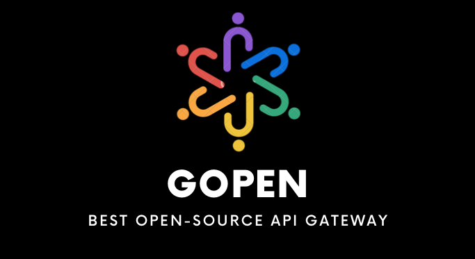

[//]: # ([![build workflow]&#40;https://github.com/GabrielHCataldo/gopen-gateway/actions/workflows/go.yml/badge.svg&#41;]&#40;https://github.com/GabrielHCataldo/gopen-gateway/actions&#41;)

---

[Portuguese](https://github.com/GabrielHCataldo/gopen-gateway/blob/main/README.pt-br.md) |

[Spanish](https://github.com/GabrielHCataldo/gopen-gateway/blob/main/README.es.md)

The GOPEN project was created with the aim of helping developers have a robust and easy-to-use API Gateway,
with the opportunity to work on improvements, bringing the community together, and most importantly, without spending
anything. He was
developed, as many API Gateways on the market for free do not meet many minimum needs
to an application, inducing it to upgrade.

With this new API Gateway you won't need to balance your plates to save on your infrastructure and architecture,
See below all available resources:

- Simplified configuration Json for multiple environments.
- Quick configuration of environment variables for multiple environments.
- Versioning via configuration json.
- Execution via docker with optional hot reload.
- Global and local timeout configuration for each endpoint.
- Global and local cache configuration for each endpoint, with customization of the storage key strategy.
- Local or global cache storage using Redis
- Configuration of global and local size limiter for each endpoint, limiting the Header, Body and Multipart size
  Memory.
- Configuration of global and local rate limiter for each endpoint, limiting by time and burst by IP.
- CORS security configuration with origin validations, http method and headers.
- Global configuration of multiple middlewares, to be used later on the endpoint if indicated.
- Customized filtering for sending headers and queries to the endpoint backends.
- Processing of multiple backends, including beforeware, main and afterware for the endpoint.
- Custom configuration to abort the backend execution process by the returned status code.
- Modifiers for all request and response contents (Status Code, Path, Header, Params, Query, Body)
  at the global level (endpoint request/response) and local level (current backend request/response) with removal
  actions,
  addition, change, replacement and renaming.
- Obtain the value to be modified from environment variables, the current request, the endpoint response history,
  or even the value passed in the configuration.
- Execute the modifiers in the context you want, before a backend request or after, it's up to you.
- Make the modifications reflected in all subsequent requests/responses, using the same at a global level.
- Omit the response from a backend if necessary, it will not be printed in the endpoint response.
- Omit the request body from your backend if necessary.
- Aggregate your multiple responses from backends if you wish, being able to customize the name of the field to be
  allocated to
  backend response.
- Group your backend response body into a specific endpoint response field.
- Customization of the endpoint response type, which can be JSON, TEXT and XML.
- Have more observability with the automatic registration of the trace ID in the header of subsequent requests and logs
  as well
  structured.

Usability and documentation
-----------
---

How to contribute?
------------
---

Thanks
------------
---
