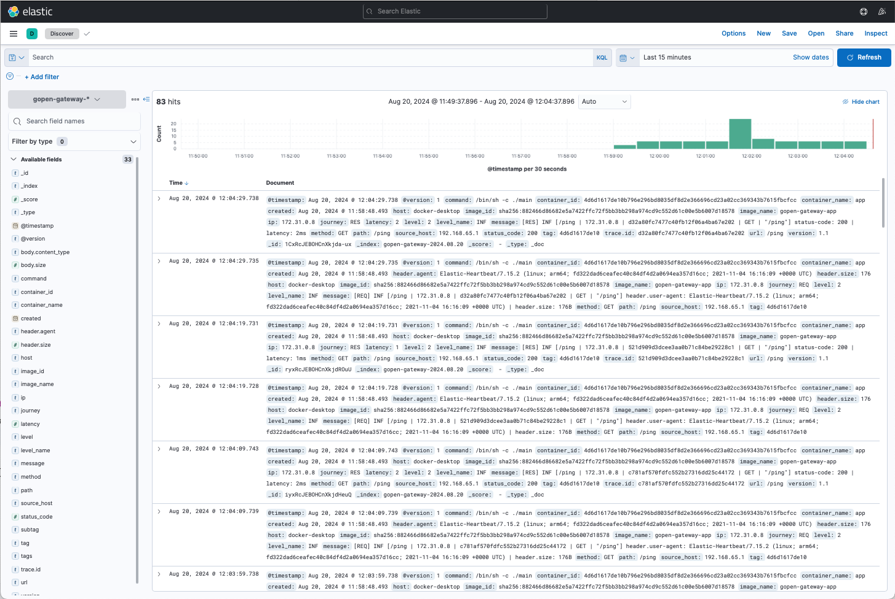
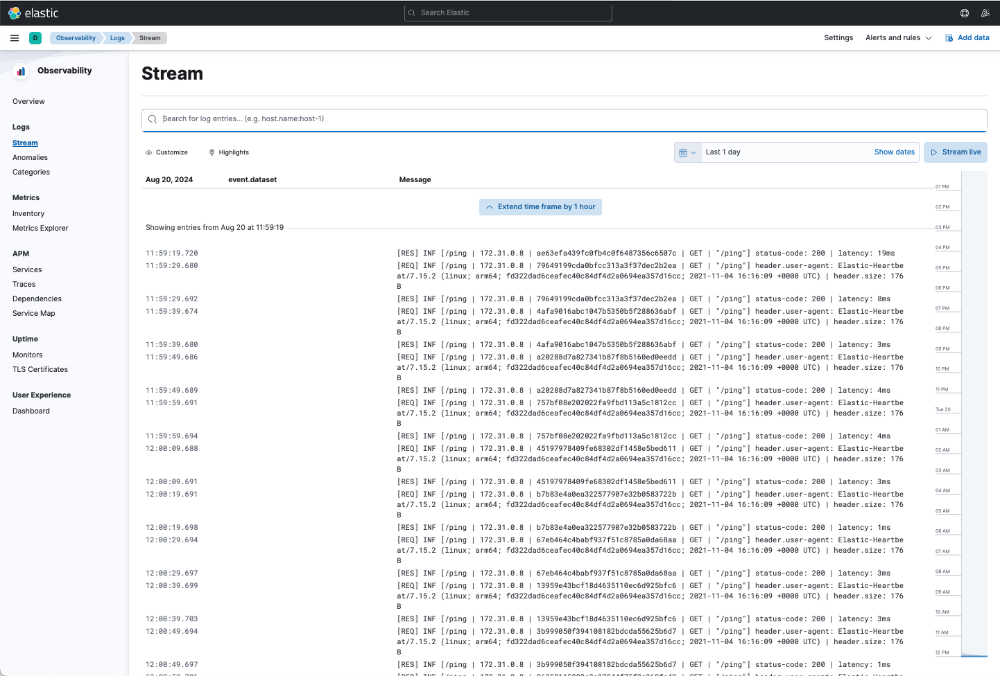
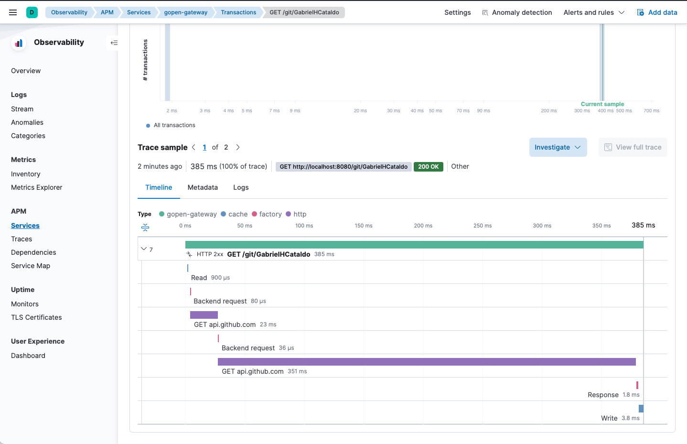

[](https://github.com/tech4works/gopen-gateway/releases/tag/v2.0.0-beta)
[](https://github.com/tech4works/gopen-gateway-playground)
[](https://hub.docker.com/r/tech4works/gopen-gateway)
[](https://goreportcard.com/report/github.com/tech4works/gopen-gateway)
[](https://github.com/tech4works/gopen-gateway/blob/main/go.mod)
[](https://pkg.go.dev/github.com/tech4works/gopen-gateway/helper)
[](https://app.fossa.com/projects/git%2Bgithub.com%2Ftech4works%2Fgopen-gateway?ref=badge_small)


[Inglês](https://github.com/tech4works/gopen-gateway/blob/main/README.en.md) |

[Espanhol](https://github.com/tech4works/gopen-gateway/blob/main/README.es.md)

O projeto GOPEN foi criado no intuito de ajudar os desenvolvedores a terem uma API Gateway robusta e de fácil manuseio,
com a oportunidade de atuar em melhorias agregando a comunidade, e o mais importante, sem gastar nada.
Foi desenvolvida, pois muitas APIs Gateway do mercado de forma gratuita, não atendem muitas necessidades mínimas
para uma aplicação, induzindo-o a fazer o upgrade.

Com essa nova API Gateway você não precisará equilibrar pratos para economizar na sua infraestrutura e arquitetura,
e ainda otimizará o seu desenvolvimento, veja abaixo todos os recursos disponíveis:

- JSON de configuração e ENVs simplificado para múltiplos ambientes.


- Timeout granular, com uma configuração padrão, mas podendo especificar para cada endpoint.


- Cache granular local ou global utilizando Redis, com estratégia e condição para o armazenamento customizável para cada
  endpoint.


- Limitador de uso e de carga granular, com uma configuração padrão, mas podendo especificar para cada endpoint.


- Segurança de CORS com validações de origens, método HTTP e headers.


- Criação de templates de beforewares, backends, afterwares.
  Evitando duplicidade nas configurações e otimizando o uso nos endpoints.


- Processamento de múltiplos tipos de backends por endpoint:
    - **HTTP**: Requisição direta a um serviço de API.
    - **PUBLISHER**: Publicação de mensagem em filas ou tópicos.


- Processe de forma paralela todos os backends do seu endpoint caso configurado.


- Aborte o processo de execução dos backends pelo código de status de forma personalizada.


- Chamadas concorrentes ao backend **HTTP** caso configurado.


- Propagação de mudança nas requisições futuras a partir de uma resposta do middleware (beforeware).


- Customização completa de requisição e resposta para o seu backend:
    - **HTTP**
        - Omita informações.
        - Mapeamento. (Header, Query e Body)
        - Projeção. (Header, Query e Body)
        - Personalização da nomenclatura do body.
        - Personalização do tipo do conteúdo do body.
        - Comprima o body de requisição usando GZIP ou DEFLATE.
        - Modificadores, pontos e ações especificas para modificar algum conteúdo específico. (Header, Query, Param,
          Body)
        - Agrupe o body de resposta num campo específico informado.
    - **PUBLISHER**
        - Omita informações vazias. (Body)
        - Mapeamento. (Body)
        - Projeção. (Body)
        - Modificadores, pontos e ações especificas para modificar algum conteúdo. (Body)
        - Construa os atributos de mensagem a partir de informacoes de requisição e respostas.


- Customização completa de resposta de endpoint:
    - Omita informações vazias do body.
    - Agregue múltiplas respostas dos backends.
    - Personalização do tipo do body.
    - Personalização da nomenclatura do body.
    - Comprima o body de requisição usando GZIP ou DEFLATE.


- Rastreamento distribuído utilizando Elastic APM, Dashboard personalizado no Kibana, e logs bem estruturados com
  informações relevantes de configuração e acessos à
  API ([exemplo](https://github.com/tech4works/gopen-gateway-playground)).

# 📖 Documentação

- [🧠 Como funciona?](#-como-funciona)
- [💡 Principais funcionalidades](#-como-funciona)
- [⚙️ Configuração](#-configuração)
    - [⚠️ Variáveis de ambiente](#variáveis-de-ambiente)
        - [🚪 PORT](#-port)
        - [📄 ENV](#-env)
    - [🗂️ Estrutura de pastas](#-estrutura-de-pastas)
    - [🛠️ JSON](#-json)
        - [👀 Exemplo](#-exemplo)
        - [📚 Tipos customizados](#-tipos-customizados)
        - [🌎 Configuração Global](#-configuração-global)
        - [📡 Endpoint](#-endpoint)
        - [🤖 Backend](#-backend)

## ⚙️ Configuração

<details>
<summary><strong style="color: steelblue">Expandir conteúdo</strong></summary>

### ⚠️ Variáveis de ambiente

<details>
<summary><strong style="color: steelblue">Expandir conteúdo</strong></summary>

Independente de como irá utilizar a API Gateway, ela exige duas variáveis de ambiente que são:

#### 🚪 PORT

Porta aonde a sua API Gateway irá ouvir e servir.

Exemplo: **8080**

#### 📄 ENV

Qual ambiente sua API Gateway irá atuar (necessario apenas se [estrutura de pastas](#estrutura-de-pastas)
tiverem referenciado seus ambientes).

Exemplo: **dev**

</details>

### 🗂️ Estrutura de pastas

<details>
<summary><strong style="color: steelblue">Expandir conteúdo</strong></summary>

Na estrutura do projeto, em sua raiz precisará ter uma pasta chamada "gopen" e dentro dela precisa ter as pastas
contendo os nomes dos seus ambientes, você pode dar o nome que quiser, essa pasta precisará ter pelo menos o arquivo
".json" de configuração da API Gateway, ficará mais o menos assim, por exemplo:

    nome-do-seu-projeto
    | - docker-compose.yml
    | - gopen
      | - dev
      |   - .json
      |   - .env // optional
      | - prd
      |   - .json

Outra opção que podemos trabalhar é inutilizar essas pastas por ambiente, funcionará de uma forma mais simples, exemplo:

    nome-do-seu-projeto
    | - docker-compose.yml
    | - gopen
      | - .json
      | - .env // optional

</details>

### 🛠️ JSON

Com base nesse arquivo JSON de configuração obtido informada,
a aplicação terá os seus endpoints e a suas regras definidas, veja abaixo todos os campos possíveis e os seus conceitos
e regras:

#### 👀 Exemplo

<details>
<summary><strong style="color: steelblue">Expandir conteúdo</strong></summary>

Abaixo adicionamos um JSON de exemplo com todas as possibilidades possíveis de configuração.

```json
```

</details>

#### 📚 Tipos customizados

<details>
<summary><strong style="color: steelblue">Expandir conteúdo</strong></summary>

Estes tipos são utilizados ao longo da configuração para padronizar valores aceitos.

##### 🔹 duration

<details>
<summary><strong style="color: steelblue">Expandir conteúdo</strong></summary>

Representa um tempo no formato número/unidade.

| Propriedade | Valor                                      | 
|-------------|--------------------------------------------|
| Tipo base   | `string`                                   |
| Formato     | `<number><unit>`                           |
| Regex       | `^(?:\d+(?:\.\d+)?(?:h\|m\|s\|ms\|us\|ns)` |

| Unidade | Descrição      |
|---------|----------------|
| `ns`    | nanossegundos  |
| `us`    | microssegundos |
| `ms`    | milissegundos  |
| `s`     | segundos       |
| `m`     | minutos        |
| `h`     | horas          |

```json
{
  "timeout": "5s",
  "duration": "15m",
  "delay": "500ms"
}
```

</details>

##### 🔹 byte-unit

<details>
<summary><strong style="color: steelblue">Expandir conteúdo</strong></summary>

Representa tamanho em bytes.

| Propriedade | Valor                                      |
|-------------|--------------------------------------------|
| Tipo base   | `string`                                   |
| Formato     | `<number><unit>`                           |
| Regex       | `^\d+(B\|KB\|MB\|GB\|TB\|PB\|EB\|ZB\|YB)$` |

| Unidade | Descrição  |
|---------|------------|
| `B`     | Bytes      |
| `KB`    | Kilobytes  |
| `MB`    | Megabytes  |
| `GB`    | Gigabytes  |
| `TB`    | Terabytes  |
| `PB`    | Petabytes  |
| `EB`    | Exabytes   |
| `ZB`    | Zettabytes |
| `YB`    | Yottabytes |

```json
{
  "max-body-size": "10MB",
  "max-header-size": "8KB"
}
```

</details>

##### 🔹 http-method

<details>
<summary><strong style="color: steelblue">Expandir conteúdo</strong></summary>

Métodos HTTP suportados.

| Tipo base | `string` |
|-----------|----------|

| Valores aceitos |
|-----------------|
| `GET`           |
| `POST`          |
| `PUT`           |
| `PATCH`         |
| `DELETE`        |

</details>

##### 🔹 backend-kind

<details>
<summary><strong style="color: steelblue">Expandir conteúdo</strong></summary>

Define o tipo de backend executado.

| Tipo base | `string` |
|-----------|----------|

| Valores aceitos | Descrição                                              |
|-----------------|--------------------------------------------------------|
| `HTTP`          | Realiza uma chamada HTTP/HTTPS para um serviço de API. |
| `PUBLISHER`     | Publica uma mensagem em tópicos ou filas.              |

</details>

##### 🔹 backend-broker

<details>
<summary><strong style="color: steelblue">Expandir conteúdo</strong></summary>

Define o broker utilizado pelo backend.

| Tipo base | `string` |
|-----------|----------|

| Valores aceitos | [Tipo de backend](#-backend-kind) |
|-----------------|-----------------------------------|
| `AWS/SQS`       | `PUBLISHER`                       |
| `AWS/SNS`       | `PUBLISHER`                       |

</details>

##### 🔹 content-type

<details>
<summary><strong style="color: steelblue">Expandir conteúdo</strong></summary>

Define o tipo de conteúdo utilizado na serialização.

| Tipo base | `string` |
|-----------|----------|

| Valores aceitos |
|-----------------|
| `JSON`          |
| `XML`           |
| `PLAIN_TEXT`    |

</details>

##### 🔹 content-encoding

<details>
<summary><strong style="color: steelblue">Expandir conteúdo</strong></summary>

Define o tipo de compressão aplicado.

| Tipo base | `string` |
|-----------|----------|

| Valores aceitos |
|-----------------|
| `NONE`          |
| `GZIP`          |
| `DEFLATE`       |

</details>

##### 🔹 nomenclature

<details>
<summary><strong style="color: steelblue">Expandir conteúdo</strong></summary>

Define o padrão de nomenclatura aplicado a campos JSON.

| Tipo base | `string` |
|-----------|----------|

| Valores aceitos   |
|-------------------|
| `LOWER_CAMEL`     |
| `CAMEL`           |
| `SNAKE`           |
| `SCREAMING_SNAKE` |
| `KEBAB`           |
| `SCREAMING_KEBAB` |

</details>

##### 🔹 template-merge

<details>
<summary><strong style="color: steelblue">Expandir conteúdo</strong></summary>

Define como o template será combinado com a configuração local.

| Tipo base | `string` |
|-----------|----------|

| Valores aceitos | Descrição                                                                                                  |
|-----------------|------------------------------------------------------------------------------------------------------------|
| `BASE`          | Mescla apenas os campos basicos como (`id`, `dependencies`, `kind`, `hosts`, `provider`, `path`, `method`) |
| `FULL`          | Mescla todos os campos.                                                                                    |

</details>
</details>

#### 🌎 Configuração Global

<details>
<summary><strong style="color: steelblue">Expandir conteúdo</strong></summary>

Campos na raiz do JSON de configuração.

| Campo           | Tipo                       | Obrigatório | Padrão | Descrição                                                                                                                         |
|-----------------|----------------------------|-------------|--------|-----------------------------------------------------------------------------------------------------------------------------------|
| `$schema`       | string                     | ❌           | —      | URL do JSON Schema para validação.                                                                                                |
| `@comment`      | string                     | ❌           | —      | Campo livre para anotações.                                                                                                       |
| `version`       | string                     | ❌           | —      | Usado para controle de versão e também usado no retorno do endpoint estático [/version](#version-1).                              |
| `hot-reload`    | boolean                    | ❌           | false  | Utilizado para o carregamento automático quando houver alguma alteração no arquivo .json e .env na pasta do ambiente selecionado. |
| `proxy`         | [object](#proxy)           | ❌           | —      | Utilizado para configurar um proxy local para expor publicamente sua API Gateway localmente.                                      |
| `store`         | [object](#-store)          | ❌           | local  | Define a configuração do armazenamento global.                                                                                    |
| `timeout`       | [duration](#-duration)     | ❌           | 30s    | Responsável pelo tempo máximo de duração do processamento de cada requisição.                                                     |
| `cache`         | [object](#-cache)          | ❌           | —      | Responsável pelas conf. globais de cache.                                                                                         |
| `limiter`       | [object](#-limiter)        | ❌           | —      | Responsável pelas regras de limitação, seja de tamanho ou taxa.                                                                   |
| `security-cors` | [object](#-security-cors)  | ❌           | —      | Responsável pela segurança e política CORS.                                                                                       |
| `templates`     | [object](#-templates)      | ❌           | —      | Responsável por instanciar as configurações de backends reutilizáveis.                                                            |
| `endpoints`     | array[[object](#endpoint)] | ✅           | —      | Representa cada endpoint da API Gateway que será registrado para ouvir e servir as requisições HTTP.                              |

##### 🗄️ Store

<details>
<summary><strong style="color: steelblue">Expandir conteúdo</strong></summary>

Objeto de configuração global para armazenamento de cache.

| Campo   | Tipo   | Obrigatório | Padrão | Descrição                                |
|---------|--------|-------------|--------|------------------------------------------|
| `redis` | object | ✅           | —      | Configuração de armazenamento via Redis. |

| Campo      | Tipo   | Obrigatório | Padrão | Descrição                          |
|------------|--------|-------------|--------|------------------------------------|
| `address`  | string | ✅           | —      | URL referente a conexão com Redis. |
| `password` | string | ❌           | —      | Senha para acesso a base Redis.    |

</details>

##### 🗃️ Cache

<details>
<summary><strong style="color: steelblue">Expandir conteúdo</strong></summary>

Objeto de configuração global de cache.

| Campo                  | Tipo                           | Obrigatório | Padrão  | Descrição                                                                                                                          |
|------------------------|--------------------------------|-------------|---------|------------------------------------------------------------------------------------------------------------------------------------|
| `enabled`              | boolean                        | ℹ️          | false   | Indica se cache esta habilitado para o endpoint. (**Apenas para o endpoint, e é obrigatório**)                                     |
| `duration`             | string                         | ✅           | —       | Tempo de vida do cache.                                                                                                            |
| `strategy-headers`     | array[string]                  | ❌           | —       | Utilizado para adicionar uma estratégia para chave do cache a partir dos headers informados, complementando o padrão `método:url`. |
| `only-if-methods`      | array[[string](#-http-method)] | ❌           | ["GET"] | Métodos HTTP aceitos.                                                                                                              |
| `only-if-status-codes` | array[int]                     | ❌           | 2xx     | Código de status aceitos.                                                                                                          |
| `allow-cache-control`  | boolean                        | ❌           | false   | Considerar ou não o header Cache-Control vindo da requisição.                                                                      |

</details>

##### 🚧 Limiter

<details>
<summary><strong style="color: steelblue">Expandir conteúdo</strong></summary>

Objeto de configuração global para limitar os recursos recebidos.

| Campo                       | Tipo                  | Obrigatório | Padrão | Descrição                                                                    |
|-----------------------------|-----------------------|-------------|--------|------------------------------------------------------------------------------|
| `max-header-size`           | [string](#-byte-unit) | ❌           | 1MB    | Responsável por limitar o tamanho do cabeçalho da requisição                 |
| `max-body-size`             | [string](#-byte-unit) | ❌           | 3MB    | Responsável por limitar o tamanho do corpo da requisição                     |
| `max-multipart-memory-size` | [string](#-byte-unit) | ❌           | 5MB    | Responsável por limitar o tamanho do corpo multipart/form da requisição      |
| `rate.capacity`             | int                   | ❌           | 5      | Indica a capacidade máxima de requisições                                    |
| `rate.every`                | [string](#-duration)  | ❌           | 1s     | Indica o valor da duração da verificação da capacidade máxima de requisições |

> ⚠️ **IMPORTANTE**
>
> Caso a requisição ultrapasse uma das regras, API Gateway irá abortar com os seguintes códigos de status:
>
> - `max-header-size`: **431 (Request header fields too large)**
> - `max-body-size` ou `max-multipart-memory-size`: **413 (Request entity too large)**
> - `rate`: **429 (Too many requests)**

</details>

##### 🔒 Security-Cors

<details>
<summary><strong style="color: steelblue">Expandir conteúdo</strong></summary>

Objeto de configuração global para de segurança CORS.

| Campo           | Tipo                           | Obrigatório | Padrão | Descrição                                                                                |
|-----------------|--------------------------------|-------------|--------|------------------------------------------------------------------------------------------|
| `allow-origins` | array[string]                  | ❌           | —      | Responsável por limitar o acesso apenas dos IPs de origem informados na lista            |
| `allow-methods` | array[[string](#-http-method)] | ❌           | —      | Responsável por limitar o acesso apenas pelos métodos HTTP informados na lista           |
| `allow-headers` | array[string]                  | ❌           | —      | Responsável por limitar o preenchimento de campos especificos do cabeçalho da requisição |

> ⚠️ **IMPORTANTE**
>
> Caso a requisição não seja permitida em uma das regras, API Gateway irá abortar com o código de status:
> **403 (Forbidden)**

</details>

##### 📝 Templates

<details>
<summary><strong style="color: steelblue">Expandir conteúdo</strong></summary>

Objeto utilizado para instanciar configurações de backends a partir do seu fluxo, evitando duplicação e melhor
reutilização dos recursos.

| Campo         | Tipo                  | Descrição                                                                           |
|---------------|-----------------------|-------------------------------------------------------------------------------------|
| `beforewares` | [object](#beforeware) | Instancia configurações de backends do fluxo beforeware. (middleware pré-backends). |
| `backends`    | [object](#backend)    | Instancia configurações de backends do fluxo principal.                             |
| `afterwares`  | [object](#backend)    | instancia configurações de backends do fluxo afterware. (middleware pós-backends).  |

</details>
</details>

#### 📡 Endpoint

<details>
<summary><strong style="color: steelblue">Expandir conteúdo</strong></summary>

Objeto que representa o endpoint da API Gateway que será registrado para ouvir e servir as requisições HTTP.

| Campo                   | Tipo                        | Obrigatório | Padrão                                  | Descrição                                                                                                     |
|-------------------------|-----------------------------|-------------|-----------------------------------------|---------------------------------------------------------------------------------------------------------------|
| `@comment`              | string                      | ❌           | —                                       | Campo livre para anotações.                                                                                   |
| `path`                  | string                      | ✅           | —                                       | Responsável pelo caminho URI do endpoint que irá ouvir e servir.                                              |
| `method`                | [string](#-http-method)     | ✅           | —                                       | Responsável por definir qual método HTTP o endpoint será registrado.                                          |
| `timeout`               | [string](#-duration)        | ❌           | [Config. Global](#-configuração-global) | Responsável pela configuração de timeout para o endpoint em questão.                                          |
| `cache`                 | [object](#cache)            | ❌           | [Config. Global](#-configuração-global) | Responsável pela configuração de cache para o endpoint em questão.                                            |
| `limiter`               | [object](#limiter)          | ❌           | [Config. Global](#-configuração-global) | Responsável pela configuração de limitação para o endpoint em questão.                                        |
| `security-cors`         | [object](#security-cors)    | ❌           | [Config. Global](#-configuração-global) | Responsável pela configuração de security CORS para o endpoint em questão.                                    |
| `abort-if-status-codes` | array[int]                  | ❌           | >= 400                                  | Indica quais codigos de status HTTP respondidos pelos backends pode ser abortado.                             |
| `parallelism`           | boolean                     | ❌           | false                                   | Indica que endpoint deverá executar todos os backends principais e afterwares de forma paralela (assíncrona). |
| `beforewares`           | array[[object](#backend)]   | ❌           | —                                       | Middlewares executados antes do fluxo principal.                                                              |
| `backends`              | array[[object](#backend)]   | ✅           | —                                       | Backends de fluxo principal.                                                                                  |
| `afterwares`            | array[[object](#backend)]   | ❌           | —                                       | Middlewares executados após o fluxo principal.                                                                |
| `response`              | [object](#endpointresponse) | ❌           | —                                       | Responsável pela customização da resposta do endpoint.                                                        |

##### 📥 Endpoint Response

<details>
<summary><strong style="color: steelblue">Expandir conteúdo</strong></summary>

Objeto responsável pela customização do cabeçalho e corpo da resposta do endpoint.
Veja mais sobre a modelagem de resposta da API Gateway [clicando aqui](#lógica-de-resposta).

| Campo               | Tipo                                 | Obrigatório | Padrão | Descrição                                                                                         |
|---------------------|--------------------------------------|-------------|--------|---------------------------------------------------------------------------------------------------|
| `@comment`          | string                               | ❌           | —      | Campo livre para anotações.                                                                       |
| `continue-on-error` | boolean                              | ❌           | false  | Indica que o endpoint deve continuar mesmo com erro na customização da resposta HTTP do endpoint. |
| `header`            | [object](#-endpoint-response-header) | ❌           | —      | Responsável pela customização do cabeçalho da resposta HTTP do endpoint.                          |
| `body`              | [object](#-endpoint-response-body)   | ❌           | —      | Responsável pela customização do corpo da resposta HTTP do endpoint.                              |

</details>

##### 🧾 Endpoint Response Header

<details>
<summary><strong style="color: steelblue">Expandir conteúdo</strong></summary>

Objeto responsável pela customização do cabeçalho da resposta do endpoint.

| Campo       | Tipo                  | Obrigatório | Padrão | Descrição                                                                                                                                   |
|-------------|-----------------------|-------------|--------|---------------------------------------------------------------------------------------------------------------------------------------------|
| `@comment`  | string                | ❌           | —      | Campo livre para anotações.                                                                                                                 |
| `mapper`    | [object](#-mapper)    | ❌           | —      | Responsável por mapear os campos do cabeçalho da resposta HTTP do endpoint, fazendo um de/para do nome do campo atual para o nome desejado. |
| `projector` | [object](#-projector) | ❌           | —      | Responsável por projetar apenas os campos que deseja do cabeçalho da resposta HTTP do endpoint.                                             |

</details>

###### 📦 Endpoint Response Body

<details>
<summary><strong style="color: steelblue">Expandir conteúdo</strong></summary>

Objeto responsável pela customização do corpo da resposta do endpoint.

| Campo              | Tipo                         | Obrigatório | Padrão | Descrição                                                                                                              |
|--------------------|------------------------------|-------------|--------|------------------------------------------------------------------------------------------------------------------------|
| `@comment`         | string                       | ❌           | —      | Campo livre para anotações.                                                                                            |
| `aggregate`        | boolean                      | ❌           | false  | Agrega todas os corpos de respostas dos backends normais no mesmo corpo de resposta.                                   |
| `omit-empty`       | boolean                      | ❌           | false  | Remove campos vazios (`null`,`""`,`0`, `false`) no corpo da resposta.                                                  |
| `content-type`     | [string](#-content-type)     | ❌           | —      | Tipo de conteúdo que deseja responder no corpo.                                                                        |
| `content-encoding` | [string](#-content-encoding) | ❌           | NONE   | Tipo de compressão que deseja responder no corpo.                                                                      |
| `nomenclature`     | [string](#-nomenclature)     | ❌           | —      | Qual tipo de nomenclatura que deseja responder no corpo JSON/XML.                                                      |
| `mapper`           | [object](#-mapper)           | ❌           | —      | Responsável por mapear os campos do corpo da resposta, fazendo um de/para do nome do campo atual para o nome desejado. |
| `projector`        | [object](#-projector)        | ❌           | —      | Responsável por projetar apenas os campos que deseja do corpo JSON da resposta.                                        |

</details>
</details>

#### 🤖 Backend

<details>
<summary><strong style="color: steelblue">Expandir conteúdo</strong></summary>

Objeto que representa o backend do endpoint da API Gateway que será executado.

| Campo              | Tipo                           | Origem   | Tipo permitido | Fluxo        | Obrigatório | Padrão | Descrição                                                                                                                        |
|--------------------|--------------------------------|----------|----------------|--------------|-------------|--------|----------------------------------------------------------------------------------------------------------------------------------|
| `@comment`         | string                         | —        | —              | —            | ❌           | —      | Campo livre para anotações.                                                                                                      |
| `id`               | string                         | `INLINE` | —              | —            | ❌           | —      | Identificador unico no endpoint do backend. Caso não informado, o campo **path** será usado como.                                |
| `dependencies`     | array[string]                  | —        | —              | —            | ❌           | —      | Indica que o mesmo depende de outros backends que precisam esta referenciado antes do mesmo na configuração do endpoint.         |
| `only-if`          | array[[string](#-eval-guards)] | —        | —              | —            | ❌           | —      | Apenas executa o backend se pelo menos 1 indice informado retornar true.                                                         |
| `ignore-if`        | array[[string](#-eval-guards)] | —        | —              | —            | ❌           | —      | Ignora a execução do backend se pelo menos 1 indice informado retornar true.                                                     |
| `template`         | [object](#-backend-template)   | `INLINE` | —              | —            | ❌           | —      | Responsável por referenciar e herdar as informações configuradas no template.                                                    |
| `kind`             | [string](#-backend-kind)       | —        | —              | —            | ℹ️          | —      | Indica qual o tipo de backend. (**Apenas obrigatório se template não informado**)                                                |
| `broker`           | [string](#-backend-broker)     | —        | `PUBLISHER`    | —            | ℹ️          | —      | Indica qual o broker do backend. (**Apenas obrigatório se tipo for PUBLISHER**)                                                  |
| `async`            | boolean                        | —        | —              | —            | ❌           | false  | Executa o backend de forma assíncrona. Ele anula o campo `parallelism` do endpoint caso informado.                               |
| `hosts`            | array[string]                  | —        | `HTTP`         | —            | ✅           | —      | Indica os hosts para o caminho do backend a ser executado. ([Veja mais sobre o balance clicando aqui](#balance))                 |
| `path`             | string                         | —        | —              | —            | ✅           | —      | Indica o caminho URI/URL do backend a ser executado.                                                                             |
| `method`           | [string](#-http-method)        | —        | `HTTP`         | —            | ✅           | —      | Responsável por definir qual método HTTP backend será executado.                                                                 |
| `request`          | [object](#-backend-request)    | —        | `HTTP`         | —            | ❌           | —      | Responsável pela customização da requisição HTTP enviada ao backend.                                                             |
| `response`         | [object](#-backend-response)   | —        | `HTTP`         | `PRINCIPAL`  | ❌           | —      | Responsável pela customização da resposta final HTTP retornada do backend.                                                       |
| `propagate`        | [object](#-backend-propagate)  | —        | —              | `BEFOREWARE` | ❌           | —      | Responsável pela propagação das proximas requisições a partir da resposta do middleware beforeware retornada do backend.         |
| `group-id`         | [string](#-dynamic-values)     | —        | `PUBLISHER`    | —            | ℹ️          | —      | Indica qual o grupo de mensagem. (**Apenas obrigatório se topico ou fila for do tipo FIFO e broker AWS**)                        |
| `deduplication-id` | [string](#-dynamic-values)     | —        | `PUBLISHER`    | —            | ℹ️          | —      | Identificador usado para detectar mensagens duplicadas. (**Apenas obrigatório se topico ou fila for do tipo FIFO e broker AWS**) |
| `delay`            | [string](#-duration)           | —        | `PUBLISHER`    | —            | ❌           | 0s     | Publica a mensagem no tópico ou fila com atraso. (**Verifique se o broker usado tem compatibilidade com entrega com atraso**)    |
| `message`          | [object](#-backend-message)    | —        | `PUBLISHER`    | —            | ❌           | —      | Responsável pela customização do payload da mensagem a ser publicado no tópico ou fila.                                          |

##### 📝 Backend Template

<details>
<summary><strong style="color: steelblue">Expandir conteúdo</strong></summary>

Objeto responsável por referenciar e herdar as informações configuradas no template.

| Campo   | Tipo                       | Obrigatório | Padrão | Descrição                                                 |
|---------|----------------------------|-------------|--------|-----------------------------------------------------------|
| `path`  | string                     | ✅           | —      | Referência o caminho do template que precisa ser herdado. |
| `merge` | [string](#-template-merge) | ❌           | FULL   | Indica qual tipo de herança que quer herdar.              |

> ⚠️ **IMPORTANTE**
>
> Só é permitido referênciar template no flow de configuração que está:
>
> - beforeware -> templates.beforewares
> - backend -> templates.backend
> - afterware -> templates.afterwares

</details>

##### 📤 Backend Request

<details>
<summary><strong style="color: steelblue">Expandir conteúdo</strong></summary>

Objeto responsável pela customização da requisição HTTP enviada ao backend.

| Campo               | Tipo                               | Obrigatório | Padrão | Descrição                                                                                                     |
|---------------------|------------------------------------|-------------|--------|---------------------------------------------------------------------------------------------------------------|
| `@comment`          | string                             | ❌           | —      | Campo livre para anotações.                                                                                   |
| `continue-on-error` | boolean                            | ❌           | false  | Indica que o backend deve continuar mesmo com erro na customização da requisição.                             |
| `concurrent`        | int                                | ❌           | 1      | Responsável pela quantidade de requisições HTTP concorrentes que deseja fazer ao serviço backend. (**Min 2**) |
| `header`            | [object](#-backend-request-header) | ❌           | —      | Responsável pela customização do cabeçalho da requisição HTTP enviada ao serviço backend.                     |
| `param`             | [object](#-backend-request-param)  | ❌           | —      | Responsável pela customização dos parâmetros da URL de requisição HTTP enviada ao serviço backend.            |
| `query`             | [object](#-backend-request-query)  | ❌           | —      | Responsável pela customização dos parâmetros de busca da requisição HTTP enviada ao serviço backend.          |
| `body`              | [object](#-backend-request-body)   | ❌           | —      | Responsável pela customização do corpo da requisição HTTP enviada ao serviço backend.                         |

###### 🧾 Backend Request Header

<details>
<summary><strong style="color: steelblue">Expandir conteúdo</strong></summary>

Objeto responsável pela customização do cabeçalho da requisição HTTP enviada ao backend.

| Campo       | Tipo                        | Obrigatório | Padrão | Descrição                                                                                                                                                    |
|-------------|-----------------------------|-------------|--------|--------------------------------------------------------------------------------------------------------------------------------------------------------------|
| `@comment`  | string                      | ❌           | —      | Campo livre para anotações.                                                                                                                                  |
| `omit`      | boolean                     | ❌           | false  | Omita todas as informações do cabeçalho vindas da requisição do endpoint para o backend.                                                                     |
| `mapper`    | [object](#-mapper)          | ❌           | —      | Responsável por mapear os campos do cabeçalho da requisição HTTP enviada ao serviço backend, fazendo um de/para do nome do campo atual para o nome desejado. |
| `projector` | [object](#-projector)       | ❌           | —      | Responsável por projetar apenas os campos que deseja do cabeçalho da requisição HTTP enviada ao serviço backend.                                             |
| `modifiers` | array[[object](#-modifier)] | ❌           | —      | Responsável por modificações especificas do cabeçalho da requisição HTTP enviada ao serviço backend.                                                         |

</details>

###### 🔗 Backend Request Param

<details>
<summary><strong style="color: steelblue">Expandir conteúdo</strong></summary>

Objeto responsável pela customização dos parâmetros da URL de requisição HTTP enviada ao backend.

| Campo       | Tipo                        | Obrigatório | Padrão | Descrição                                                                                                     |
|-------------|-----------------------------|-------------|--------|---------------------------------------------------------------------------------------------------------------|
| `@comment`  | string                      | ❌           | —      | Campo livre para anotações.                                                                                   |
| `modifiers` | array[[object](#-modifier)] | ❌           | —      | Responsável por modificações especificas dos parâmetros da URL de requisição HTTP enviada ao serviço backend. |

</details>

###### 🔎 Backend Request Query

<details>
<summary><strong style="color: steelblue">Expandir conteúdo</strong></summary>

Objeto responsável pela customização dos parâmetros de busca da requisição HTTP enviada ao backend.

| Campo       | Tipo                        | Obrigatório | Padrão | Descrição                                                                                                                                                    |
|-------------|-----------------------------|-------------|--------|--------------------------------------------------------------------------------------------------------------------------------------------------------------|
| `@comment`  | string                      | ❌           | —      | Campo livre para anotações.                                                                                                                                  |
| `omit`      | boolean                     | ❌           | false  | Omita todas as informações de buscas vindas da requisição do endpoint para o backend.                                                                        |
| `mapper`    | [object](#-mapper)          | ❌           | —      | Responsável por mapear os parâmetros de busca da requisição HTTP enviada ao serviço backend, fazendo um de/para do nome do campo atual para o nome desejado. |
| `projector` | [object](#-projector)       | ❌           | —      | Responsável por projetar apenas os parâmetros de busca que deseja da requisição HTTP enviada ao serviço backend.                                             |
| `modifiers` | array[[object](#-modifier)] | ❌           | —      | Responsável por modificações especificas dos parâmetros de busca da requisição HTTP enviada ao serviço backend.                                              |

</details>

###### 📦 Backend Request Body

<details>
<summary><strong style="color: steelblue">Expandir conteúdo</strong></summary>

Objeto responsável pela customização do corpo da resposta do endpoint.

| Campo              | Tipo                         | Obrigatório | Padrão | Descrição                                                                                                                                                |
|--------------------|------------------------------|-------------|--------|----------------------------------------------------------------------------------------------------------------------------------------------------------|
| `@comment`         | string                       | ❌           | —      | Campo livre para anotações.                                                                                                                              |
| `omit`             | boolean                      | ❌           | false  | Omita todas as informações do corpo vindas da requisição HTTP do endpoint para o backend.                                                                |
| `omit-empty`       | boolean                      | ❌           | false  | Remove campos vazios (`null`,`""`,`0`, `false`) no corpo da requisição HTTP enviada ao serviço backend.                                                  |
| `content-type`     | [string](#-content-type)     | ❌           | —      | Tipo de conteúdo que deseja enviar no corpo da requisição HTTP enviada ao serviço backend.                                                               |
| `content-encoding` | [string](#-content-encoding) | ❌           | NONE   | Tipo de compressão que deseja enviar no corpo da requisição HTTP enviada ao serviço backend.                                                             |
| `nomenclature`     | [string](#-nomenclature)     | ❌           | —      | Qual tipo de nomenclatura que deseja enviar no corpo JSON/XML da requisição HTTP enviada ao serviço backend.                                             |
| `mapper`           | [object](#-mapper)           | ❌           | —      | Responsável por mapear os campos do corpo da requisição HTTP enviada ao serviço backend, fazendo um de/para do nome do campo atual para o nome desejado. |
| `projector`        | [object](#-projector)        | ❌           | —      | Responsável por projetar apenas os campos que deseja do corpo JSON da requisição HTTP enviada ao serviço backend.                                        |
| `modifiers`        | array[[object](#-modifier)]  | ❌           | —      | Responsável por modificações especificas dos campos do corpo da requisição HTTP enviada ao serviço backend.                                              |

</details>

</details>
</details>
</details>

## JSON de tempo de execução

O Gopen API Gateway quando iniciado, gera um arquivo JSON, baseado no [JSON de configuração](#json-de-configuração),
localizado na pasta `runtime` na raiz da sua aréa de trabalho.

Esse JSON, indica qual foi o entendimento da aplicação ao ler o [JSON de configuração](#json-de-configuração), todas
as [#variáveis de configuração](#variáveis-de-ambiente) já terão seus valores substituídos, caso exista.

Esse json também pode ser lido utilizando a rota estática [/settings](#settings).

## Rotas estáticas

O Gopen API Gateway tem alguns endpoints estáticos, isto é, indepêndente de qualquer configuração feita, teremos
atualmente três endpoints cadastrados nas rotas do mesmo, veja abaixo cada um e suas responsabilidades:

### ping

Endpoint para saber se a API Gateway está viva o path, retorna `404 (Not found)` se tiver off, e
`200 (OK)` se tiver no ar.

### version

Endpoint que retorna a versão obtida na config [version](#version), retorna `404 (Not Found)` se não tiver sido
informado no [json de configuração](#json-de-configuração), caso contrário retorna o `200 (OK)` com o valor no body
como texto.

### settings

Endpoint retorna algumas informações sobre o projeto, como versão, data da versão, quantidade de contribuintes e
um resumo de quantos endpoints, middlewares, backends e modifiers configurados no momento e o json de configuração
que está rodando ativamente.

```json
{
  "version": "v1.0.0",
  "version-date": "03/27/2024",
  "founder": "Gabriel Cataldo",
  "contributors": 1,
  "endpoints": 4,
  "middlewares": 1,
  "backends": 7,
  "setting": {}
}
```

## Variáveis de ambiente

As variáveis de ambiente podem ser fácilmente instânciadas utilizando o arquivo .env, na pasta indicada pelo ambiente
dinâmico de inicialização como mencionado no tópico [ESTRUTURA DE PASTAS](#estrutura-de-pastas).

Caso preferir inserir os valores utilizando docker-compose também funcionará corretamente, ponto é que a API
Gateway irá ler o valor gravado na máquina, independente de como foi inserido nela.

Os valores podem ser utilizados na configuração do JSON da API Gateway, basta utilizar a sintaxe `$NOME` como
um valor string, veja no exemplo abaixo.

Um trecho de um JSON de configuração, temo os seguintes valores:

```json
{
  "version": "$VERSION",
  "hot-reload": true,
  "store": {
    "redis": {
      "address": "$REDIS_URL",
      "password": "$REDIS_PASSWORD"
    }
  },
  "timeout": "$TIMEOUT"
}
```

E na nossa máquina temos as seguintes variáveis de ambiente:

```dotenv
VERSION=1.0.0

REDIS_URL=redis-18885.c259.us-east-1-4.ec2.cloud.redislabs.com:18985
REDIS_PASSWORD=12345

TIMEOUT=5m
```

A API Gateway gera um arquivo de [JSON de tempo de execução](#json-de-tempo-de-execução) ao rodar a aplicação, veja o
resultado do mesmo após iniciar a aplicação:

```json
{
  "version": "1.0.0",
  "hot-reload": true,
  "store": {
    "redis": {
      "address": "redis-18885.c259.us-east-1-4.ec2.cloud.redislabs.com:18985",
      "password": "12345"
    }
  },
  "timeout": "5m"
}
```

Vimos que todos os valores com a sintaxe `$NOME` foram substituídos pelos seus devidos valores, caso um valor
tenha sido mencionado por essa sintaxe, porém não existe nas variáveis de ambiente, o mesmo valor informado
será mantido.

## Valores dinâmicos para modificação

Podemos utilizar valores de requisição e resposta do tempo de execução do endpoint, conforme o mesmo foi configurado.
Esses valores podem ser obtidos por uma sintaxe específica, temos as seguintes possibilidades de obtenção desses
valores, veja:

### Requisição

Quando menciona a sintaxe `#request...` você estará obtendo os valores da requisição recebida.

#### #request.header...

Esse trecho da sintaxe irá obter do cabeçalho da requisição o valor indicado, por exemplo,
`#request.header.X-Forwarded-For.0` irá obter o primeiro valor do campo `X-Forwarded-For` do cabeçalho da requisição
caso exista, substituindo a sintaxe pelo valor, o resultado foi `127.0.0.1`.

#### #request.params...

Esse trecho da sintaxe irá obter dos parâmetros da requisição o valor indicado, por exemplo,
`#request.params.id` irá obter o valor do campo `id` dos parâmetros da requisição caso exista,
substituindo a sintaxe pelo valor, o resultado foi `72761`.

#### #request.query...

Esse trecho da sintaxe irá obter dos parâmetros de busca da requisição o valor indicado, por exemplo,
`#request.query.email.0` irá obter o primeiro valor do campo `email` dos parâmetros de busca da requisição caso exista,
substituindo a sintaxe pelo valor, o resultado foi `gabrielcataldo.adm@gmail.com`.

#### #request.body...

Esse trecho da sintaxe irá obter do body da requisição o valor indicado, por exemplo,
`#request.body.deviceId` irá obter o valor do campo `deviceId` do body da requisição caso exista,
substituindo a sintaxe pelo valor, o resultado foi `991238`.

### Resposta

Quando menciona a sintaxe `#responses...` você estará obtendo os valores do histórico de respostas dos backends do
endpoint sendo [beforewares](#endpointbeforewares), [backends](#endpointbackends) e [afterwares](#endpointafterwares)

No exemplo, eu tenho apenas um backend e o mesmo foi processado, então posso está utilizando a sintaxe:

`#responses.0.header.X-Value.0`

Nesse outro exemplo de sintaxe temos três backends configurados e dois já foram processados, então podemos utilizar a
seguinte sintaxe no processo do terceiro backend:

`#responses.1.body.users.0`

Nesses exemplos citados vemos que podemos obter o valor da resposta de um backend que já foi processado,
e que estão armazenados em um tipo de histórico temporário.

### Importante

Você pode utilizar com base nesses campos,
a [sintaxe de JSON path](https://github.com/tidwall/gjson/blob/master/README.md#path-syntax) que se enquadra em seus
valores, apenas se lembre que, os objetos header, query são mapas de lista de string, e o params é um mapa de string.

Aprenda na prática como utilizar os valores dinâmicos para modificação usando o
projeto [playground](https://github.com/tech4works/gopen-gateway-playground) que já vem com alguns exemplos de
modificadores com valores dinâmicos.

## Lógica de resposta

Quando utilizamos uma API Gateway nos perguntamos, como será retornado ao meu cliente a resposta desse endpoint
configurado?

Para facilitar o entendimento criamos esse tópico para resumir a lógica de resposta da nossa API Gateway,
então vamos começar.

### Como funciona?

A API Gateway foi desenvolvida com uma inteligência e flexibilidade ao responder um endpoint, ela se baseia em dois
pontos importantes, primeiro, na quantidade de respostas de serviços backends que foram processados, e segundo, nos
campos de customização da resposta configurados nos objetos [endpoint](#endpointcomment)
e [backend](#endpointbackendcomment).
Vamos ver alguns exemplos abaixo para melhor entendimento.

#### Único backend

Nesse exemplo trabalharemos apenas com um único backend, veja como a API Gateway se comportará ao responder
a esse cenário:

JSON de configuração

```json
{
  "$schema": "https://raw.githubusercontent.com/tech4works/gopen-gateway/main/json-schema.json",
  "endpoints": [
    {
      "path": "/users/find/:key",
      "method": "GET",
      "backends": [
        {
          "hosts": [
            "$USER_SERVICE_URL"
          ],
          "path": "/users/find/:key",
          "method": "GET"
        }
      ]
    }
  ]
}
```

Ao processar esse endpoint a resposta da API Gateway foi:

```text
HTTP/1.1 200 OK
```

Cabeçalho ([Veja sobre os cabeçalhos de resposta aqui](#cabeçalho-de-resposta))

```text
Content-Type: application/json
X-Gopen-Cache: false
X-Gopen-Complete: true
X-Gopen-Success: true
Date: Tue, 23 Apr 2024 11:37:26 GMT
Content-Length: 620
```

Corpo

```json
{
  "id": "6499b8826493f85e45eb3794",
  "name": "Gabriel Cataldo",
  "birthDate": "1999-01-21T00:00:00Z",
  "gender": "MALE",
  "currentPage": "HomePage",
  "createdAt": "2023-06-26T16:10:42.265Z",
  "updatedAt": "2024-03-10T20:19:03.452Z"
}
```

Vimos que no exemplo a API Gateway serviu como um proxy redirecionando a requisição para o serviço backend configurado e
espelhando seu body de resposta, e agregando seus valores no cabeçalho de resposta.

Nesse mesmo exemplo vamos forçar um cenário de infelicidade na resposta do backend, veja:

```text
HTTP/1.1 404 Not Found
```

Cabeçalho ([Veja sobre os cabeçalhos de resposta aqui](#cabeçalho-de-resposta))

```text
Content-Type: application/json
X-Gopen-Cache: false
X-Gopen-Complete: true
X-Gopen-Success: false
Date: Tue, 23 Apr 2024 21:56:33 GMT
Content-Length: 235
```

Corpo

```json
{
  "file": "datastore/user.go",
  "line": 227,
  "endpoint": "/users/find/gabrielcataldo.adma@gmail.com",
  "message": "user not found"
}
```

Neste caso a API Gateway também espelhou a resposta da única chamada de backend do endpoint.

#### Utilizando middlewares

Nesse exemplo, vamos utilizar os middlewares de [beforewares](#endpointbeforewares) e [afterwares](#endpointafterwares),
como esses backends são omitidos ao cliente final se tiverem sucesso, vamos simular uma chamada com o device bloqueado
para que o [beforeware](#endpointbeforewares) retorne um erro, e depois um [afterware](#endpointafterwares) que
responderá também um erro, pois não existe, vamos lá!

JSON de configuração

```json
{
  "$schema": "https://raw.githubusercontent.com/tech4works/gopen-gateway/main/json-schema.json",
  "middlewares": {
    "save-device": {
      "hosts": [
        "$DEVICE_SERVICE_URL"
      ],
      "path": "/devices",
      "method": "PUT"
    },
    "increment-attempts": {
      "hosts": [
        "$SECURITY_SERVICE_URL"
      ],
      "path": "/attempts",
      "method": "POST"
    }
  },
  "endpoints": [
    {
      "path": "/users/find/:key",
      "method": "GET",
      "beforewares": [
        "save-device"
      ],
      "afterwares": [
        "increment-attempts"
      ],
      "backends": [
        {
          "hosts": [
            "$USER_SERVICE_URL"
          ],
          "path": "/users/find/:key",
          "method": "GET"
        }
      ]
    }
  ]
}
```

Ao processar esse endpoint de exemplo simulando o erro na chamada de [beforeware](#endpointbeforewares) a resposta da
API Gateway foi:

```text
HTTP/1.1 403 Forbidden
```

Cabeçalho ([Veja sobre os cabeçalhos de resposta aqui](#cabeçalho-de-resposta))

```text
Content-Type: application/json
X-Gopen-Cache: false
X-Gopen-Complete: false
X-Gopen-Success: true
Date: Tue, 23 Apr 2024 23:02:09 GMT
Content-Length: 154
```

Corpo

```json
{
  "file": "service/device.go",
  "line": 49,
  "endpoint": "/devices",
  "message": "unprocessed entity: device already exists and is not active"
}
```

Vimos que a resposta foi o espelho do retorno do beforeware `save-device`, pois como o mesmo retornou
falha `403 (Forbidden)`, o endpoint abortou, não chamando os backends seguintes, lembrando que você
pode configurar os códigos de status HTTP que vão ser abortados pelo seu endpoint, basta preencher o
campo [endpoint.abort-if-status-codes](#endpointabort-if-status-codes).

No seguinte exemplo iremos forçar um erro no afterware `increment-attempts` a da API Gateway resposta foi:

```text
HTTP/1.1 404 Not Found
```

Cabeçalho ([Veja sobre os cabeçalhos de resposta aqui](#cabeçalho-de-resposta))

```text
Content-Type: text/plain
X-Gopen-Cache: false
X-Gopen-Complete: true
X-Gopen-Success: false
Date: Tue, 23 Apr 2024 23:16:57 GMT
Content-Length: 18
```

Corpo

```text
404 page not found
```

Vimos que a resposta também foi o espelho do retorno do afterware `increment-attempts`, por mais que seja a última
chamada de um serviço backend do endpoint, pois caiu na regra de resposta abortada, então, todas as outras respostas
dos outros backends foram ignoradas e apenas foi retornado a resposta do backend abortado.

Veja mais sobre a [resposta abortada](#resposta-abortada).

#### Múltiplos backends

Nesse exemplo iremos trabalhar com três [backends](#endpointbackends) principais no endpoint, então, vamos lá!

JSON de configuração

```json
{
  "$schema": "https://raw.githubusercontent.com/tech4works/gopen-gateway/main/json-schema.json",
  "port": 8080,
  "endpoints": [
    {
      "path": "/users/find/:key",
      "method": "GET",
      "backends": [
        {
          "hosts": [
            "$USER_SERVICE_URL"
          ],
          "path": "/users/find/:key",
          "method": "GET"
        },
        {
          "hosts": [
            "$DEVICE_SERVICE_URL"
          ],
          "path": "/devices",
          "method": "PUT"
        },
        {
          "hosts": [
            "$USER_SERVICE_URL"
          ],
          "path": "/version",
          "method": "GET",
          "response": {
            "group": "version"
          }
        }
      ]
    }
  ]
}
```

No exemplo iremos executar os três backend com sucesso, a API Gateway respondeu

```text
HTTP/1.1 200 OK
```

Cabeçalho ([Veja sobre os cabeçalhos de resposta aqui](#cabeçalho-de-resposta))

```text
Content-Type: application/json
X-Gopen-Cache: false
X-Gopen-Complete: true
X-Gopen-Success: true
Date: Tue, 23 Apr 2024 23:49:12 GMT
Content-Length: 755
```

Corpo

```json
[
  {
    "ok": true,
    "code": 200,
    "id": "6499b8826493f85e45eb3794",
    "name": "Gabriel Cataldo",
    "birthDate": "1999-01-21T00:00:00Z",
    "gender": "MALE",
    "currentPage": "HomePage",
    "createdAt": "2023-06-26T16:10:42.265Z",
    "updatedAt": "2024-03-10T20:19:03.452Z"
  },
  {
    "ok": true,
    "code": 200,
    "id": "661535275d6fc736d831c754",
    "usersId": [
      "6499b8826493f85e45eb3793"
    ],
    "status": "ACTIVE",
    "createdAt": "2024-04-09T12:31:35.907Z",
    "updatedAt": "2024-04-23T23:49:12.759Z"
  },
  {
    "ok": true,
    "code": 200,
    "version": "v1.0.0"
  }
]
```

Temos alguns pontos nesse exemplo que vale ressaltar, primeiro com o formato, a API Gateway entendeu que seu endpoint
tem múltiplas respostas e não foi utilizado o campo [endpoint.response.aggregate](#endpointresponseaggregate)
com o valor `true`, então ela lista as respostas como JSON acrescentando os seguintes campos:

`ok`: Indica se a resposta do backend em questão teve o código de status HTTP entre `200` e `299`.

`code`: É preenchido com código de status HTTP respondido pelo seu backend.

Esses campos são apenas acrescentado se houver múltiplas respostas e o
campo [endpoint.response.aggregate](#endpointresponseaggregate) não for informado com o valor `true`.

Segundo ponto a destacar é no trecho `"version": "v1.0.0"` do último backend, o mesmo respondeu apenas um texto no body
de resposta que foi `v1.0.0`, porém para esse cenário como foi mencionado, a API Gateway força a conversão desse valor
para um JSON, adicionando um novo campo com o valor informado na
configuração [endpoint.backend.response.group](#endpointbackendresponsegroup) do mesmo.

Terceiro ponto é sobre o código de status HTTP, o mesmo é retornado pela maior frequência, isto é, se temos três
retornos `200 OK` como no exemplo a API Gateway também retornará esse código. Se tivermos um retorno igualitário o
último código de status HTTP retornado será considerado, veja os cenários possíveis dessa lógica:

```json
[
  {
    "ok": true,
    "code": 204
  },
  {
    "ok": true,
    "code": 200
  },
  {
    "ok": true,
    "code": 201
  }
]
```

a API Gateway responderá `201 Created`.

```json
[
  {
    "ok": true,
    "code": 100
  },
  {
    "ok": true,
    "code": 100
  },
  {
    "ok": true,
    "code": 201
  }
]

```

a API Gateway responderá `100 Continue`.

Quarto ponto a ser destacado, é que como o endpoint tem múltiplas respostas, consequentemente temos múltiplos cabeçalhos
de resposta, a API Gateway irá agregar todos os campos e valores para o cabeçalho da resposta final, veja mais sobre o
comportamento do cabeçalho de resposta [clicando aqui](#cabeçalho-de-resposta).

Último ponto a ser destacado, é que caso um desses retornos de backend entre no cenário em que o endpoint aborta a
resposta, ele não seguirá nenhuma diretriz mostrada no tópico em questão e sim
[lógica de resposta abortada](#resposta-abortada).

#### Múltiplos backends agregados

Nesse exemplo iremos utilizar uma configuração parecida com JSON de configuração do exemplo acima, porém com
campo [endpoint.response.aggregate](#endpointresponseaggregate) com o valor `true`.

JSON de configuração

```json
{
  "$schema": "https://raw.githubusercontent.com/tech4works/gopen-gateway/main/json-schema.json",
  "endpoints": [
    {
      "path": "/users/find/:key",
      "method": "GET",
      "response": {
        "aggregate": true
      },
      "backends": [
        {
          "hosts": [
            "$USER_SERVICE_URL"
          ],
          "path": "/users/find/:key",
          "method": "GET"
        },
        {
          "hosts": [
            "$DEVICE_SERVICE_URL"
          ],
          "path": "/devices",
          "method": "PUT"
        },
        {
          "hosts": [
            "$USER_SERVICE_URL"
          ],
          "path": "/version",
          "method": "GET",
          "response": {
            "group": "version"
          }
        }
      ]
    }
  ]
}
```

Ao processarmos o endpoint a resposta da API Gateway foi:

```text
HTTP/1.1 200 OK
```

Cabeçalho ([Veja sobre os cabeçalhos de resposta aqui](#cabeçalho-de-resposta))

```text
Content-Type: application/json
X-Gopen-Cache: false
X-Gopen-Complete: true
X-Gopen-Success: true
Date: Wed, 24 Apr 2024 10:57:31 GMT
Content-Length: 665
```

Corpo

```json
{
  "id": [
    "6499b8826493f85e45eb3794",
    "661535275d6fc736d831c754"
  ],
  "name": "Gabriel Cataldo",
  "gender": "MALE",
  "currentPage": "HomePage",
  "lastSeenAt": "2024-02-19T11:43:27.324Z",
  "createdAt": [
    "2024-04-09T12:31:35.907Z",
    "2023-06-26T16:10:42.265Z"
  ],
  "updatedAt": [
    "2024-04-24T11:04:32.184Z",
    "2024-03-10T20:19:03.452Z"
  ],
  "usersId": [
    "6499b8826493f85e45eb3793"
  ],
  "status": "ACTIVE",
  "version": "v1.0.0"
}
```

Vimos a única diferença de resposta do tópico [Múltiplos backends](#múltiplos-backends) é que ele agregou os valores
de todas as respostas em um só JSON, e os campos que se repetiram foram agregados os valores em lista.

As demais regras como código de status HTTP, a conversão forçada para JSON, entre outras, seguem as mesmas regras
mencionadas no tópico [Múltiplos backends](#múltiplos-backends).

No exemplo podemos deixar a resposta agregada um pouco mais organizada, com isso vamos alterar o trecho do nosso
segundo backend adicionando o campo [endpoint.backend.response.group](#endpointbackendresponsegroup) com o
valor `device`, veja o trecho do JSON de configuração modificado:

```json
{
  "hosts": [
    "$DEVICE_SERVICE_URL"
  ],
  "path": "/devices",
  "method": "PUT",
  "response": {
    "group": "device"
  }
}
```

Ao processar novamente o endpoint obtivemos a seguinte resposta:

```text
HTTP/1.1 200 OK
```

Cabeçalho ([Veja sobre os cabeçalhos de resposta aqui](#cabeçalho-de-resposta))

```text
Content-Type: application/json
X-Gopen-Cache: false
X-Gopen-Complete: true
X-Gopen-Success: true
Date: Wed, 24 Apr 2024 11:23:07 GMT
Content-Length: 697
```

Corpo

```json
{
  "id": "6499b8826493f85e45eb3793",
  "name": "Gabriel Cataldo",
  "birthDate": "1999-01-21T00:00:00Z",
  "gender": "MALE",
  "currentPage": "HomePage",
  "lastSeenAt": "2024-02-19T11:43:27.324Z",
  "createdAt": "2023-06-26T16:10:42.265Z",
  "updatedAt": "2024-03-10T20:19:03.452Z",
  "device": {
    "id": "661535275d6fc736d831c754",
    "usersId": [
      "6499b8826493f85e45eb3793"
    ],
    "status": "ACTIVE",
    "createdAt": "2024-04-09T12:31:35.907Z",
    "updatedAt": "2024-04-24T11:23:07.832Z"
  },
  "version": "v1.0.0"
}
```

Com essa configuração vimos que nossa resposta agregada ficou mais organizada, e como é importante entender sobre
o [json de configuração](#json-de-configuração) e seus campos, para que o GOPEN API Gateway atenda melhor suas
necessidades.

### Resposta abortada

Para uma resposta ser abortada pela API Gateway, um dos backends configurados do endpoint tanto middlewares
como os principais, ao serem processados, na sua resposta, o código de status HTTP precisa seguir valores
no campo [endpoint.abort-if-status-codes](#endpointabort-if-status-codes) do próprio endpoint.

**IMPORTANTE**

Ao abortar a resposta do backend, a API Gateway irá espelhar apenas a resposta do mesmo, código de status, cabeçalho e
corpo, sendo assim, as outras respostas já processadas serão ignoradas.

Indicamos utilizar essa configuração apenas quando algo fugiu do esperado, como, por exemplo, uma resposta
`500 (Internal server error)`.

### Cabeçalho de resposta

Na resposta, a API Gateway com exceção dos campos `Content-Length`, `Content-Type` e `Date` agrega todos valores de
cabeçalho respondidos pelos backends configurados no endpoint, indepêndente da quantidade de backends.

#### Campos de cabeçalho padrão

Também são adicionados até quatro campos no cabeçalho veja abaixo sobre os mesmos:

- `X-Gopen-Timeout`: Enviado na requisição ao backend, ele contém o tempo restante para o processamento em
  milissegundos, com o mesmo dá para implementar um contexto com timeout linear nos seus microserviços, evitando
  vazamento
  de processos, já que após esse tempo a API Gateway retornara [504 (Gateway Timeout)](#504-gateway-timeout).


- `X-Gopen-Cache`: Caso a resposta do endpoint não seja "fresca", isto é, foi utilizado a resposta armazenada em cache,
  é retornado o valor `true`, caso contrário retorna o valor `false`.


- `X-Gopen-Cache-Ttl`: Caso a resposta do endpoint tenha sido feita utilizando o armazenamento em cache, ele retorna a
  duração do tempo de vida restante desse cache, caso contrário o campo não é retornado.


- `X-Gopen-Complete`: Caso todos os backends tenham sido processados pelo endpoint é retornado o valor `true`, caso
  contrário é retornado o valor `false`.


- `X-Gopen-Success`: Caso todos os backends tenham retornado sucesso, isto é, o código de status HTTP de resposta entre
  `200` a `299`, ele retorna o valor `true`, caso contrário o valor `false`.

Lembrando que se a resposta de um backend for [abortada](#resposta-abortada), apenas o header do mesmo é agregado e
considerado as regras dos campos acima.

Agora vamos ver alguns exemplos de cabeçalho de retorno:

#### Campos únicos de cabeçalho

Cabeçalho de resposta do backend 1:

```text
Content-Type: application/json
X-Value-Id: 4ae6c92d16089e521626
X-MS: api-user
Date: Wed, 24 Apr 2024 11:23:07 GMT
Content-Length: 102
```

Cabeçalho de resposta do endpoint

```text
Content-Type: application/json
X-Value-Id: 4ae6c92d16089e521626
X-MS: api-user
X-Gopen-Cache: false
X-Gopen-Complete: true
X-Gopen-Success: true
Date: Wed, 24 Apr 2024 11:23:08 GMT
Content-Length: 102
```

Vimos que no exemplo foram adicionados os [campos padrões](#campos-de-cabeçalho-padrão), e agregado os valores do
cabeçalho de resposta, que foram `X-Value-Id` e `X-MS`.

#### Campos duplicados de cabeçalho

Cabeçalho de resposta do backend 1:

```text
Content-Type: application/json
X-Value-Id: 4ae6c92d16089e521626
X-MS: api-user
Date: Wed, 24 Apr 2024 11:23:07 GMT
Content-Length: 102
```

Cabeçalho de resposta do backend 2:

```text
Content-Type: application/json
X-Value-Id: 4ae6c92d16089e521638
X-MS: api-device
X-MS-Success: true
Date: Wed, 24 Apr 2024 11:23:08 GMT
Content-Length: 402
```

Cabeçalho de resposta do endpoint

```text
Content-Type: application/json
X-Value-Id: 4ae6c92d16089e521626, 4ae6c92d16089e521638
X-MS: api-user, api-device
X-MS-Success: true
X-Gopen-Cache: false
X-Gopen-Complete: true
X-Gopen-Success: true
Date: Wed, 24 Apr 2024 11:23:09 GMT
Content-Length: 504
```

Vimos que no exemplo também foram adicionados os [campos padrões](#campos-de-cabeçalho-padrão), e agregado os valores do
cabeçalho de resposta, que foram `X-Value-Id`, `X-MS` e `X-MS-Success`, vale ressaltar que os campos que se repetiram
foram agrupados e separados por vírgula.

### Respostas padrões

Toda API Gateway tem suas respostas padrão para cada cenário de erro, então iremos listar abaixo cada
cenário e sua respectiva resposta HTTP:

#### 204 (No Content)

Esse cenário acontece quando todos os backends forem preenchidos com a configuração
[endpoint.backend.response.omit](#endpointbackendresponseomit-body) como `true` e o endpoint foi processado
corretamente,
porém não há nada a ser retornado.

#### 413 (Request Entity Too Large)

Esse cenário acontece quando o tamanho do corpo de requisição é maior do que o permitido para o endpoint, utilizando a
configuração [limiter.max-body-size](#limitermax-header-size) para corpo normal
e [limiter.max-multipart-memory-size](#limitermax-multipart-memory-size) para envio do tipo `form-data`. Você pode
customizar essa configuração para um endpoint específico utilizando o campo [endpoint.limiter](#endpointlimiter).

Cabeçalho

```text
Content-Type: application/json
X-Gopen-Cache: false
X-Gopen-Complete: false
X-Gopen-Success: false
Date: Fri, 26 Apr 2024 11:56:06 GMT
Content-Length: 170
```

Corpo

```json
{
  "file": "infra/size_limiter.go",
  "line": 92,
  "endpoint": "/users",
  "message": "payload too large error: permitted limit is 1.0B",
  "timestamp": "2024-04-26T08:56:06.628636-03:00"
}
```

#### 429 (Too many requests)

Esse cenário acontece quando o limite de requisições são atingidas por um determinado IP, esse limite é definido na
configuração [limiter.rate](#limiterrate). Você pode customizar essa configuração para um endpoint
específico utilizando o campo [endpoint.limiter](#endpointlimiter).

Cabeçalho

```text
Content-Type: application/json
X-Gopen-Cache: false
X-Gopen-Complete: false
X-Gopen-Success: false
Date: Fri, 26 Apr 2024 12:12:53 GMT
Content-Length: 177
```

Corpo

```json
{
  "file": "infra/rate_limiter.go",
  "line": 100,
  "endpoint": "/users",
  "message": "too many requests error: permitted limit is 1 every 1s",
  "timestamp": "2024-04-26T09:12:53.501804-03:00"
}
```

#### 431 (Request Header Fields Too Large)

Esse cenário acontece quando o tamanho do header é maior do que o permitido para o endpoint, utilizando a
configuração [limiter.max-header-size](#limitermax-header-size). Você pode customizar essa configuração para um endpoint
específico utilizando o campo [endpoint.limiter](#endpointlimiter).

Cabeçalho

```text
Content-Type: application/json
X-Gopen-Cache: false
X-Gopen-Complete: false
X-Gopen-Success: false
Date: Fri, 26 Apr 2024 11:39:53 GMT
Content-Length: 186
```

Corpo

```json
{
  "file": "infra/size_limiter.go",
  "line": 80,
  "endpoint": "/multiple/backends/:key",
  "message": "header too large error: permitted limit is 1.0B",
  "timestamp": "2024-04-26T08:39:53.944055-03:00"
}
```

#### 500 (Internal server error)

Esse cenário é específico quando algum erro inesperado ocorreu com a API Gateway, caso isso aconteça relate
o problema [aqui](https://github.com/tech4works/gopen-gateway/issues) mostrando a resposta e o log impresso no
terminal de execução.

Cabeçalho

```text
Content-Type: application/json
X-Gopen-Cache: false
X-Gopen-Complete: false
X-Gopen-Success: false
Date: Fri, 26 Apr 2024 12:38:16 GMT
Content-Length: 183
```

Corpo

```json
{
  "file": "interceptor/panic_recovery.go",
  "line": 27,
  "endpoint": "/users",
  "message": "gateway panic error occurred! detail: runtime error: invalid memory address or nil pointer dereference",
  "timestamp": "2024-04-26T09:42:23.938997-03:00"
}
```

#### 502 (Bad Gateway)

Esse cenário acontece quando ao tentar se comunicar com o backend, e ocorre alguma falha de comunicação com o mesmo.

Cabeçalho

```text
Content-Type: application/json
X-Gopen-Cache: false
X-Gopen-Complete: false
X-Gopen-Success: false
Date: Thu, 25 Apr 2024 01:07:36 GMT
Content-Length: 277
```

Corpo

```json
{
  "file": "infra/rest.go",
  "line": 69,
  "endpoint": "/users/find/:key",
  "message": "bad gateway error: Get \"http://192.168.1.8:8090/users/find/gabrielcataldo.adm@gmail.com\": dial tcp 192.168.1.8:8090: connect: connection refused",
  "timestamp": "2024-04-24T22:07:36.558851-03:00"
}
```

#### 504 (Gateway Timeout)

Esse cenário acontece quando o endpoint excede o limite do tempo configurado no campo [timeout](#timeout). Você pode
customizar essa configuração para um endpoint específico utilizando o campo [endpoint.timeout](#endpointtimeout).

Cabeçalho

```text
Content-Type: application/json
X-Gopen-Cache: false
X-Gopen-Complete: false
X-Gopen-Success: false
Date: Fri, 26 Apr 2024 13:29:55 GMT
Content-Length: 150
```

Corpo

```json
{
  "file": "interceptor/timeout.go",
  "line": 81,
  "endpoint": "/users/version",
  "message": "gateway timeout: 5m",
  "timestamp": "2024-04-26T10:29:55.908526-03:00"
}
```

## Observabilidade

O Gopen API Gateway tem por padrão uma integração com Elastic, podendo utilizar alguns serviços veja:

### Dashboard


### Discover



### Stream Logs



### APM Services


### APM Trace



Vale destacar que preservamos e enviamos o trace para os serviços backend subjacentes utilizando o Elastic APM Trace,
e sempre adicionamos o campo `X-Forwarded-For` com o IP do client.

# Usabilidade

- [Playground](https://github.com/tech4works/gopen-gateway-playground) um repositório para começar a explorar e aprender
  na prática!


- [Base](https://github.com/tech4works/gopen-gateway-base) um repositório para começar o seu novo projeto, apenas com o
  necessário!

# Como contríbuir?

Ficamos felizes quando vemos a comunidade se apoiar, e projetos como esse, está de braços abertos para receber
suas ideias, veja abaixo como participar.

## Download

Para conseguir rodar o projeto primeiro faça o download da [linguagem Go](https://go.dev/dl/)
versão 1.22 ou superior na sua máquina.

Com o Go instalado na sua máquina, faça o pull do projeto

```text
git pull https://github.com/tech4works/gopen-gateway.git
```

Depois abra o mesmo usando o próprio terminal com a IDE de sua preferência

Goland:

```text
goland gopen-gateway
```

VSCode:

```text
code gopen-gateway
```

## Gitflow

Para inicializar o desenvolvimento, você pode criar uma branch a partir da main, para um futuro PR para a mesma.

# Agradecimentos

Esse projeto teve apoio de bibliotecas fantásticas, esse trecho dedico a cada uma listada
abaixa:

- [checker](https://github.com/tech4works/checker)
- [converter](https://github.com/tech4works/converter)
- [errors](https://github.com/tech4works/errors)
- [fsnotify](https://github.com/fsnotify/fsnotify)
- [gin](https://github.com/gin-gonic/gin)
- [gjson](https://github.com/tidwall/gjson)
- [sjson](https://github.com/tidwall/sjson)
- [mxj](https://github.com/clbanning/mxj/v2)
- [strcase](https://github.com/iancoleman/strcase)
- [uuid](https://github.com/google/uuid)
- [godotenv](https://github.com/joho/godotenv)
- [gojsonschema](https://github.com/xeipuuv/gojsonschema)
- [go-redis](https://github.com/redis/go-redis)
- [ttlcache](https://github.com/jellydator/ttlcache)

Obrigado por contribuir para a comunidade Go e facilitar o desenvolvimento desse projeto.

# Licença Apache 2.0

[](https://app.fossa.com/projects/git%2Bgithub.com%2Ftech4works%2Fgopen-gateway?ref=badge_large&issueType=license)
